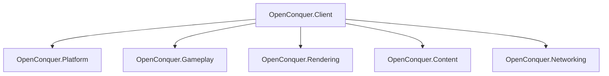

# OpenConquer Client

[](https://github.com/berniemackie97/OpenConquerClient/actions/workflows/ci.yml)

A modern, cross-platform client for **Conquer Online 5517**, written in C# on .NET 10.

This project is a ground-up reimplementation of the original Windows C++ client for use with my
**OpenConquer Server** project. OpenConquer Server is the recommended server for this client, but
other 5517-compatible servers should still work.

The goal is to preserve the behavior, protocol, content formats, and feel of the original client
while rebuilding it on a clean modern foundation.

> **Status:** Early development. The desktop platform and native-compatible logical rendering
> foundation are in place, with gameplay, content, networking, and higher-level rendering systems
> still being built.

## Architecture



The client is split into a small set of focused assemblies:

- **OpenConquer.Client** — executable, subsystem composition, application lifetime, and shutdown
  coordination
- **OpenConquer.Platform** — desktop windowing, native graphics-context lifetime, physical
  framebuffer state, and native buffer swapping
- **OpenConquer.Gameplay** — world state and game simulation
- **OpenConquer.Rendering** — OpenGL integration, logical rendering, logical-to-host framebuffer
  composition, and GPU resources
- **OpenConquer.Content** — original client formats and content loading
- **OpenConquer.Networking** — transport, encryption, packets, and server protocol

`OpenConquer.Platform` and `OpenConquer.Rendering` are separate sibling subsystems. Platform owns
the native window and OpenGL context, while Rendering owns the OpenGL API binding, render targets,
GPU resources, and construction of the completed host framebuffer. `OpenConquer.Client` composes the
two and coordinates their lifetimes without creating a direct dependency between them.

The current renderer uses **OpenGL 3.3 Core through Silk.NET**.

Game rendering uses a fixed logical surface independent of the resizable desktop framebuffer. The
application reads the original client's screen-mode configuration and selects either the 800×600 or
1024×768 logical resolution accordingly. Rendering copies that logical frame across the physical
host framebuffer, after which Platform performs the native buffer swap.

More detailed architecture and compatibility documentation lives under [`docs`](docs).

## Build

Dependencies are pinned by the committed NuGet lock files, so restore in locked mode:

```bash
dotnet restore OpenConquer.Client.slnx --locked-mode
```

```bash
dotnet build OpenConquer.Client.slnx --configuration Release --no-restore
```

## Tests

```bash
dotnet test OpenConquer.Client.slnx --configuration Release --no-build --no-restore
```

## Running

```bash
dotnet run --project src/OpenConquer.Client -- --content-root <path> --presentation fit
```

`--presentation` selects how the fixed logical frame is fitted into the resizable window:

| Value | Behaviour |
|---|---|
| `fit` (default) | largest distortion-free scale, centred with pillarbox or letterbox bars |
| `integer` | largest whole-number scale, centred; sharpest, larger bars |
| `stretch` | fills the window, distorting whenever the aspect ratios differ |

To verify formatting:

```bash
dotnet format OpenConquer.Client.slnx --verify-no-changes --no-restore
```

## Repository

```text
src/
├── OpenConquer.Client/
├── OpenConquer.Content/
├── OpenConquer.Gameplay/
├── OpenConquer.Networking/
├── OpenConquer.Platform/
└── OpenConquer.Rendering/

tests/
├── OpenConquer.Client.Tests/
├── OpenConquer.Content.Tests/
├── OpenConquer.Platform.Tests/
└── OpenConquer.Rendering.Tests/

docs/
tools/
```

## Compatibility

The original Conquer Online 5517 client is used as the behavioral reference during development.

Reverse-engineered native details are used to establish how the original client behaved, but this
client is designed around clear game concepts rather than reproducing the original implementation
structure.

Intentional modernizations, such as the resizable desktop host window, are kept outside the game's
logical rendering coordinate system and other compatibility-sensitive behavior.

## Platforms

OpenConquer Client is being developed for:

- Windows
- macOS
- Linux
