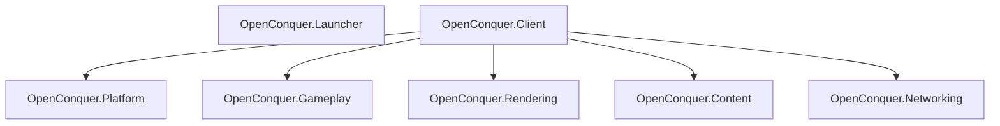

# OpenConquer Client

[](https://github.com/berniemackie97/OpenConquerClient/actions/workflows/ci.yml)

A C#/.NET 10 reconstruction of the Conquer Online 5517 client ecosystem for Windows, macOS, and
Linux, designed for OpenConquer Server.

**Early development. The launcher is not release-ready.**

## Current capabilities

| Product | Implemented | Still required |
| --- | --- | --- |
| Launcher | Avalonia host, redacted diagnostics, managed-package resolution, installation recheck, single-instance activation, coordinated shutdown, saved display preferences | Trusted release integrity, update/repair, secure client startup, complete player UX, signed platform packaging |
| Client | Resizable/fixed/fullscreen host, logical rendering and presentation, verified bootstrap content | Networking, gameplay, higher-level rendering |

The launcher replaces `Play.exe` as the product entry point. Launcher and client remain independent
executables and dependency boundaries. A staged package contains both; the launcher automatically
resolves its own installation and never asks the player to locate game files.

Opening the launcher again activates the existing window for the current user. See
[instance ownership](docs/architecture/launcher-instances.md) for startup and recovery behavior.

An **installation found** result currently proves package layout only. It does not verify release
integrity or authorize game startup. **Check again** re-evaluates an unavailable installation after
its files or permissions have been restored; it does not perform repair.

## Products and architecture



The launcher and game client are separate executable products. The client composes its runtime
subsystems; Platform and Rendering remain independent siblings.

The intended production lifecycle is:

```text
launcher → installation/readiness → update/repair as required → pre-launch settings
         → verified, authorized OpenConquer.Client startup
client   → realm selection → native AccountServer login → GameServer handoff → game
```

The capability table above distinguishes implemented stages from those still being built.

## Build and verify

Use the exact SDK in [`global.json`](global.json). Dependencies use committed NuGet lock files.

```bash
dotnet restore OpenConquer.Client.slnx --locked-mode
dotnet format OpenConquer.Client.slnx --verify-no-changes --no-restore
dotnet build OpenConquer.Client.slnx -c Release --no-restore
dotnet test OpenConquer.Client.slnx -c Release --no-build --no-restore
```

CI builds and tests on Linux, Windows, and macOS. The Linux quality job also checks formatting,
content integrity, independent publishes, and managed-product composition. These gates do not
replace native desktop checks, platform packaging, signing, or notarization.

## Run

For the launcher, [publish and stage a managed product](docs/development.md#launcher), then run its
`OpenConquer.Launcher` executable (`.exe` on Windows). A raw launcher project output has no installed
client component and reports an unavailable installation.

For direct client development:

```bash
dotnet run --project src/OpenConquer.Client -- \
  --window-size 1280x720 --window-mode resizable --presentation fit
```

| Client option | Values |
| --- | --- |
| `--window-size` | `WIDTHxHEIGHT`; default `1280x720` |
| `--window-mode` | `resizable` (default), `fixed`, `fullscreen` |
| `--presentation` | `fit` (default), `integer`, `stretch` |
| `--content-root` | Explicit authorized 5517 content tree; defaults to packaged content |

The current internal render surface is 800×600 or 1024×768, selected by compatibility
`ini/GameSetUp.ini`. Desktop size and mode are independent. Installed retail content is not rewritten
for player preferences. The launcher saves modern [display preferences](docs/architecture/launcher-settings.md);
delivery through controlled client startup remains unimplemented.

## Compatibility rules

- Preserve verified 5517 AccountServer packets, credential transformations, cryptography, results,
  and game handoff semantics. Native/deob evidence and the current server contract must be audited
  before implementing protocol behavior. OAuth/OIDC is not a replacement for native login.
- Credentials and session material must not pass through arguments, environment variables, or
  plaintext temporary files. Account login and native game-session handoff belong to Client/Networking.
  Launcher startup authorization establishes product provenance, not account authentication.
- Keep the content manifest, runtime consumer closure, tracked payload, and client publish equal.
  The current bootstrap payload is `Logo1.bmp`, `Logo2.bmp`, `GameSetUp.ini`, `info.ini`, and
  `package.ini`; see the [content plan](docs/content/retail-5517-content-plan.md).

```text
ClientContentClosure
        ==
tracked content manifest
        ==
tracked runtime payload
        ==
published OpenConquer.Client content set
```

## Developer reference

| Need | Read |
| --- | --- |
| Build, run, publish, content-tool commands | [Development](docs/development.md) |
| Product dependencies and ownership | [Architecture](docs/architecture/architecture.md) |
| Package schema, installation recovery, desktop smoke checks | [Managed installation](docs/architecture/launcher-managed-installation.md) |
| Native rendering behavior | [Graphics compatibility](docs/compatibility/native-graphics.md) |
| Content provenance and ingestion | [Retail inventory](docs/content/retail-5517-inventory.md), [content plan](docs/content/retail-5517-content-plan.md) |

## Repository

```text
src/
├── OpenConquer.Client/
├── OpenConquer.Content/
├── OpenConquer.Gameplay/
├── OpenConquer.Launcher/
├── OpenConquer.Networking/
├── OpenConquer.Platform/
└── OpenConquer.Rendering/

tests/
├── OpenConquer.Client.Tests/
├── OpenConquer.Content.Tests/
├── OpenConquer.Content.Tool.Tests/
├── OpenConquer.Launcher.Tests/
├── OpenConquer.Platform.Tests/
├── OpenConquer.Product.Tool.Tests/
└── OpenConquer.Rendering.Tests/

content/
docs/
tools/
├── OpenConquer.Content.Tool/
└── OpenConquer.Product.Tool/
```
