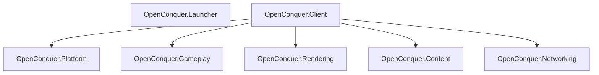

# OpenConquer Client

[](https://github.com/berniemackie97/OpenConquerClient/actions/workflows/ci.yml)

C#/.NET 10 reconstruction of the Conquer Online 5517 client ecosystem for Windows, macOS, and Linux.

**Early development. The launcher is not release-ready.**

## Current Capabilities

| Product | Implemented | Remaining |
| --- | --- | --- |
| Launcher | Managed installation resolution, authenticated releases, integrity verification, update/repair/rollback transaction, single-instance activation, saved display preferences | Production release origin, launcher self-update, player-facing maintenance flow, controlled client startup |
| Client | Desktop host, logical rendering/presentation, verified retail content, TGA/DXT3 sprites, native text rendering, static main-HUD chrome, life/mana/stamina HUD vitals | Live gameplay state, networking, remaining HUD/UI, maps, roles, effects, animation |

## Architecture



Launcher and game client are separate products.

```text
launcher
→ installation readiness
→ update / repair
→ pre-launch settings
→ controlled client startup

client
→ realm selection
→ AccountServer login
→ GameServer handoff
→ game
```

## Build

Use the SDK pinned by [`global.json`](global.json).

```bash
dotnet restore OpenConquer.Client.slnx --locked-mode
dotnet format OpenConquer.Client.slnx --verify-no-changes --no-restore
dotnet build OpenConquer.Client.slnx -c Release --no-restore
dotnet test OpenConquer.Client.slnx -c Release --no-build --no-restore
```

CI builds and tests on Linux, Windows, and macOS.

Real-driver rendering conformance runs separately on supported desktop hardware against exact retail 5517 content.

## Run

Create or refresh the local managed product:

```bash
dotnet run \
  --project tools/OpenConquer.Product.Tool \
  --configuration Release \
  -- \
  create-local-product
```

Output:

```text
artifacts/local-product/product
```

macOS/Linux:

```bash
./artifacts/local-product/product/OpenConquer.Launcher
```

Windows:

```powershell
.\artifacts\local-product\product\OpenConquer.Launcher.exe
```

Direct client development:

```bash
dotnet run --project src/OpenConquer.Client -- \
  --window-size 1280x720 \
  --window-mode resizable \
  --presentation fit
```

Client options:

| Option | Values |
| --- | --- |
| `--window-size` | `WIDTHxHEIGHT`; default `1280x720` |
| `--window-mode` | `resizable`, `fixed`, `fullscreen` |
| `--presentation` | `fit`, `integer`, `stretch` |
| `--content-root` | Authorized retail-compatible content tree |

Logical rendering is restricted to 800×600 or 1024×768 according to `ini/GameSetUp.ini`.

Desktop size, window mode, and presentation are independent.

## Compatibility

Native 5517 behavior is the compatibility authority.

Preserve verified:

```text
protocol packets
credential transformations
cryptography
login results
game handoff semantics

logical rendering
content paths and lookup behavior
sprite behavior
HUD geometry and ordering
```

Do not preserve obsolete implementation machinery when observable behavior can be reproduced safely.

### Runtime Content

The managed runtime closure currently contains 19 files:

```text
startup configuration
startup logos
Control.ani

Progress45 HUD background
Dialog4 HUD panels

Progress40 life frames
Progress41 mana frames
Progress46 stamina frames
Progress47 extended-stamina frames
```

Required invariant:

```text
ClientContentClosure
        ==
tracked manifest
        ==
tracked payload
        ==
published client content
```

Retail WDF archives are import sources and are not shipped in the curated content set.

Retail `Server.dat` remains offline compatibility evidence and is not runtime content.

### HUD

Implemented native HUD order:

```text
Progress45 background
Progress40 life
Progress41 mana
Progress46 stamina
Progress47 extended stamina
Dialog4 panels
```

Remaining HUD groups are implemented only after native behavior and dependencies are verified.

## Repository

```text
src/
├── OpenConquer.Client/
├── OpenConquer.Content/
├── OpenConquer.Gameplay/
├── OpenConquer.Launcher/
├── OpenConquer.Networking/
├── OpenConquer.Platform/
└── OpenConquer.Rendering/

tests/
├── Conformance/
│   └── OpenConquer.Rendering.Conformance/
├── OpenConquer.Client.Tests/
├── OpenConquer.Content.Tests/
├── OpenConquer.Content.Tool.Tests/
├── OpenConquer.Launcher.Tests/
├── OpenConquer.Platform.Tests/
├── OpenConquer.Product.Tool.Tests/
└── OpenConquer.Rendering.Tests/

content/
docs/

tools/
├── OpenConquer.Content.Tool/
└── OpenConquer.Product.Tool/
```

## Documentation

| Area | Document |
| --- | --- |
| Development | [`docs/development.md`](docs/development.md) |
| Architecture | [`docs/architecture/architecture.md`](docs/architecture/architecture.md) |
| Managed installation | [`docs/architecture/launcher-managed-installation.md`](docs/architecture/launcher-managed-installation.md) |
| Native graphics | [`docs/compatibility/native-graphics.md`](docs/compatibility/native-graphics.md) |
| Native text | [`docs/compatibility/native-text.md`](docs/compatibility/native-text.md) |
| Retail content | [`docs/content/retail-5517-content-plan.md`](docs/content/retail-5517-content-plan.md) |
| Retail inventory | [`docs/content/retail-5517-inventory.md`](docs/content/retail-5517-inventory.md) |
