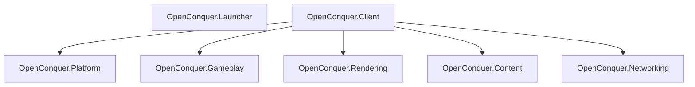

# OpenConquer Client

[](https://github.com/berniemackie97/OpenConquerClient/actions/workflows/ci.yml)

A modern, cross-platform reconstruction of the **Conquer Online 5517** client ecosystem, written in
C# on .NET 10.

The repository contains two desktop products:

- **OpenConquer.Launcher** — the modern launcher and future account/update/startup boundary
- **OpenConquer.Client** — the reconstructed game client

The project is designed for use with **OpenConquer Server** while preserving verified 5517 client
behavior, protocol semantics, content formats, rendering characteristics, and gameplay feel wherever
they remain relevant.

The original Windows C++ client is a behavioral and compatibility reference, not an architectural
template. Obsolete deployment, security, UI, and platform mechanisms are replaced with explicit
modern boundaries when reproducing them would weaken the resulting product.

> **Status:** Early development. The desktop game host, native-compatible logical rendering
> foundation, retail-content boundary, legacy content tooling, and hardened launcher process
> foundation are in place. Gameplay, networking, launcher authentication, secure game launch, realm
> discovery, and higher-level rendering systems are still being built.

## Products and Architecture



The launcher and game client are separate executable products.

### OpenConquer.Launcher

`OpenConquer.Launcher` is a .NET 10 desktop application using Avalonia.

Its current host boundary owns:

- launcher process startup and shutdown;
- Avalonia application lifetime;
- the primary launcher-window shell;
- explicit standard-user process policy on Windows;
- bounded per-user structured diagnostics;
- fatal host-exception observation and nonzero terminal failure semantics;
- managed product-root resolution from the installed launcher package;
- automatic installation-boundary evaluation owned by the application lifecycle;
- an independent package/publish boundary.

Diagnostic persistence is best-effort and must not become a launcher availability dependency.
Unhandled host faults are recorded through a deliberately redacted diagnostic projection rather than
serializing raw exceptions or arbitrary application state.

The launcher deliberately does **not** reference the game client's runtime subsystem projects or
Silk.NET.

Account authentication, secure launcher-to-game authorization, updating, repair, and realm-facing
launcher workflows have not yet been implemented. Those capabilities are introduced only through
separately audited implementation slices.

### OpenConquer.Client

`OpenConquer.Client` is the game-runtime composition root.

Its runtime subsystems are:

- **OpenConquer.Platform** — game desktop windowing, native graphics-context lifetime, physical
  framebuffer state, frame-loop orchestration, pacing mechanics, and native buffer swapping
- **OpenConquer.Gameplay** — world state and game simulation
- **OpenConquer.Rendering** — OpenGL integration, logical rendering, logical-to-host framebuffer
  composition, and GPU resources
- **OpenConquer.Content** — required original client formats, content-root behavior, WDF routing,
  and runtime content loading
- **OpenConquer.Networking** — future game transport, encryption, packet framing, and protocol
  encoding/decoding

`OpenConquer.Platform` and `OpenConquer.Rendering` are sibling subsystems. Platform owns the native
game window and OpenGL context, while Rendering owns the OpenGL API binding, render targets, GPU
resources, and construction of the completed host framebuffer.

`OpenConquer.Client` composes those lifetimes without introducing a Platform → Rendering or
Rendering → Platform dependency.

The current renderer uses **OpenGL 3.3 Core through Silk.NET**.

Game rendering keeps the original client's fixed logical coordinate surface independently of the
desktop host. The compatibility `ini/GameSetUp.ini` screen mode currently supplies either an 800×600
or 1024×768 logical render size; that is an internal game coordinate surface, not the player's
desktop resolution. The launcher-owned launch contract supplies the requested desktop size, window
mode, and presentation policy.

Detailed architecture and compatibility documentation lives under [`docs`](docs).

## Native-Parity Authentication Direction

`OpenConquer.Launcher` implements the retail `Play.exe` product role and is the intended supported
entry point. There is no additional user-facing bootstrap executable.

The intended production lifecycle is:

```text
launcher → installation/readiness → update/repair as required → pre-launch settings
         → native account login → AccountServer authentication/handoff → Play
         → controlled OpenConquer.Client startup → native-compatible game bootstrap
```

The launcher now resolves its managed product context automatically from the installed package. It
does not ask a player to browse for or manually enter a game directory. This establishes the
installation boundary only; trusted release integrity, update/repair, login, and game launch remain
future responsibilities.

The managed package layout and startup states are documented in
[`launcher-managed-installation.md`](docs/architecture/launcher-managed-installation.md).

Account authentication must preserve the original 5517 packets, credential transformations,
AccountServer results, and login-to-game handoff semantics. Moving the login UI into the launcher
does not authorize OAuth, OIDC, bearer-token login, or another replacement wire protocol. Native/deob
evidence is authoritative; retail artifacts, legacy reconstruction, and the rewrite follow in that
order. Packet implementation requires an audit of native evidence and the current server contract.

Retail `Server.dat` remains offline evidence/tooling only. A runtime server-discovery source and
selection flow must be designed explicitly from native login requirements without restoring that
file or hardcoding endpoints into UI controls.

Credentials and sensitive session material must never cross into the client through command-line
arguments, environment variables, or plaintext temporary files. Private local IPC may carry the
native handoff once its ownership, security, and failure semantics have been implemented and tested.
It must not invent a replacement game-authentication system.

The remaining slices and current audit are recorded in
[`docs/architecture/launcher-roadmap.md`](docs/architecture/launcher-roadmap.md).

## Retail Content

Checked-in retail content is intentionally consumer-led rather than a bulk preservation of the
original client tree.

The current runtime content closure contains exactly:

```text
data/main/Logo1.bmp
data/main/Logo2.bmp
ini/GameSetUp.ini
ini/info.ini
ini/package.ini
```

`ini/GameSetUp.ini` remains part of the compatibility content set because the native-compatible
bootstrap uses its screen-mode value for the internal logical render surface. Launcher display
preferences are per-user launch settings and are supplied separately; the installed retail payload
is not rewritten for an individual player's window choice.

The following must remain equal:

```text
ClientContentClosure
        ==
tracked content manifest
        ==
tracked runtime payload
        ==
published OpenConquer.Client content set
```

Historical files required only for reverse-engineering evidence, parity testing, or offline tooling
remain outside the runtime closure.

The exact retail 5517 `Server.dat` fixture is one such artifact and is preserved under the content
tool's test data rather than shipped with the game.

The content evidence inventory and consumer-led ingestion policy are documented in
[`docs/content`](docs/content).

## Build

Dependencies are centrally versioned and resolved through committed NuGet lock files.

Restore in locked mode:

```bash
dotnet restore OpenConquer.Client.slnx --locked-mode
```

Build the complete solution:

```bash
dotnet build OpenConquer.Client.slnx \
  --configuration Release \
  --no-restore
```

## Tests

Run the complete solution test suite:

```bash
dotnet test OpenConquer.Client.slnx \
  --configuration Release \
  --no-build \
  --no-restore
```

Current test projects:

```text
OpenConquer.Client.Tests
OpenConquer.Content.Tests
OpenConquer.Content.Tool.Tests
OpenConquer.Launcher.Tests
OpenConquer.Platform.Tests
OpenConquer.Product.Tool.Tests
OpenConquer.Rendering.Tests
```

The launcher tests protect product/dependency boundaries, Windows process policy, diagnostic path
and redaction invariants, bounded stack/type projection, and host exception-observation behavior
without requiring a native desktop session.

## Running

### Launcher

```bash
dotnet publish src/OpenConquer.Client/OpenConquer.Client.csproj \
  --configuration Release \
  --output /tmp/openconquer-client-publish

dotnet publish src/OpenConquer.Launcher/OpenConquer.Launcher.csproj \
  --configuration Release \
  --output /tmp/openconquer-launcher-publish

dotnet run \
  --project tools/OpenConquer.Product.Tool \
  -- \
  stage-managed-product \
  --launcher-publish /tmp/openconquer-launcher-publish \
  --client-publish /tmp/openconquer-client-publish \
  --output /tmp/openconquer-managed

/tmp/openconquer-managed/OpenConquer.Launcher
```

The launcher must run from the staged managed product root. A raw launcher project output is not an
installed OpenConquer product and correctly reports that its client component is unavailable.
Authentication, patching, repair, and game-start orchestration have not yet been implemented.

### Game Client

```bash
dotnet run --project src/OpenConquer.Client/OpenConquer.Client.csproj
```

The default game build stages the implemented bootstrap subset from the versioned retail content
set.

Pass `--content-root <path>` to run against another authorized 5517 client tree:

```bash
dotnet run \
  --project src/OpenConquer.Client/OpenConquer.Client.csproj \
  -- \
  --content-root /path/to/client
```

`--window-size` selects the requested desktop size. It is independent of the compatibility logical
render size:

```text
--window-size WIDTHxHEIGHT
```

The direct-client default is `1280x720`. A launcher launch request should provide this value from
the user's saved display preference rather than editing installed retail content.

`--window-mode` selects the desktop game-window mode independently of both resolutions:

| Value                 | Behaviour                                      |
| --------------------- | --------------------------------------------- |
| `resizable` (default) | player can resize the game window              |
| `fixed`               | game window uses the requested window size     |
| `fullscreen`          | game window is presented fullscreen            |

`--presentation` selects how the fixed logical frame is presented by the selected game window:

| Value           | Behaviour                                                               |
| --------------- | ----------------------------------------------------------------------- |
| `fit` (default) | largest distortion-free scale, centred with pillarbox or letterbox bars |
| `integer`       | largest whole-number scale, centred; sharpest, larger bars              |
| `stretch`       | fills the window, distorting whenever the aspect ratios differ          |

Direct execution of `OpenConquer.Client` remains useful for development and reconstruction work. It
is not the intended final production account-authentication path.

## Offline Content Tooling

Verify the checked-in runtime content set:

```bash
dotnet run \
  --project tools/OpenConquer.Content.Tool \
  -- \
  verify-content-set \
  --content-set content/retail-5517
```

Inspect an explicit historical retail `Server.dat`:

```bash
dotnet run \
  --project tools/OpenConquer.Content.Tool \
  -- \
  inspect-server-dat \
  --file /path/to/Server.dat
```

Legacy `Server.dat` tooling does not provide runtime realm discovery or connection configuration.

## Formatting

```bash
dotnet format OpenConquer.Client.slnx \
  --verify-no-changes \
  --no-restore
```

## Continuous Integration

CI runs on Ubuntu, Windows, and macOS.

The Linux quality gate performs:

- locked dependency restore;
- formatting verification;
- Release build;
- complete solution tests;
- runtime content-set verification;
- game-client publication;
- published-client content verification;
- explicit rejection of published `Server.dat`;
- launcher publication;
- verification that the launcher does not acquire the game's retail runtime content.

Windows and macOS independently restore, build, and test the complete solution.

Runtime-identifier-specific packaging, installers, signing, notarization, self-contained deployment,
and native application bundles are separate future release-engineering concerns.

## Repository

```text
src/
├── OpenConquer.Client/
├── OpenConquer.Content/
├── OpenConquer.Gameplay/
├── OpenConquer.Launcher/
├── OpenConquer.Networking/
├── OpenConquer.Platform/
└── OpenConquer.Rendering/

tests/
├── OpenConquer.Client.Tests/
├── OpenConquer.Content.Tests/
├── OpenConquer.Content.Tool.Tests/
├── OpenConquer.Launcher.Tests/
├── OpenConquer.Platform.Tests/
├── OpenConquer.Product.Tool.Tests/
└── OpenConquer.Rendering.Tests/

content/
docs/
tools/
├── OpenConquer.Content.Tool/
└── OpenConquer.Product.Tool/
```

## Compatibility

The original Conquer Online 5517 client is used as the behavioral reference during development.

Reverse-engineered native details establish what the original client did. The managed implementation
is organized around explicit modern product and subsystem boundaries rather than reproducing the
native implementation structure.

Compatibility-sensitive behavior is preserved when evidence establishes that behavior as part of the
5517 game contract.

Intentional modernizations—such as the launcher architecture, resizable game host window, secure
future authentication boundaries, and removal of `Server.dat` from runtime configuration—are kept
explicit and documented rather than silently changing compatibility behavior.

## Platforms

OpenConquer is being developed for:

- Windows
- macOS
- Linux
