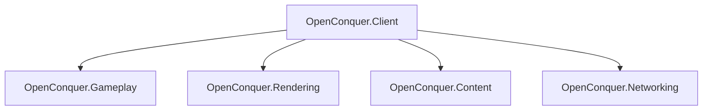

# OpenConquer Client

A modern, cross platform client for **Conquer Online 5517**, written in C# on .NET 10.

This project is a ground up reimplementation of the original Windows C++ client for use with my
**OpenConquer Server** project. OpenConquer Server is the recommended server for this client, but
other 5517 servers should still work.

The goal is to preserve the behavior, protocol, content formats, and feel of the original client
while rebuilding it on a clean modern foundation.

> **Status:** Early development. Core client architecture and runtime systems are currently being
> built.

## Architecture



The client is split into a small set of focused assemblies:

- **OpenConquer.Client** — executable, application lifecycle, windowing, input, and composition
- **OpenConquer.Gameplay** — world state and game simulation
- **OpenConquer.Rendering** — rendering and GPU resources
- **OpenConquer.Content** — original client formats and content loading
- **OpenConquer.Networking** — transport, encryption, packets, and server protocol

The initial renderer uses **OpenGL through Silk.NET**.

More detailed design documentation lives under [`docs/architecture`](docs/architecture).

## Build

Requires the .NET SDK version specified in [`global.json`](global.json).

```bash
dotnet restore
dotnet build OpenConquer.Client.slnx
```

To verify formatting:

```bash
dotnet format OpenConquer.Client.slnx --verify-no-changes
```

## Repository

```text
src/
├── OpenConquer.Client/
├── OpenConquer.Content/
├── OpenConquer.Gameplay/
├── OpenConquer.Networking/
└── OpenConquer.Rendering/

tests/
docs/
tools/
```

## Compatibility

The original Conquer Online 5517 client is used as the behavioral reference during development.

Reverse engineered native details are used to establish how the original client behaved, but this
client is designed around clear game concepts rather than reproducing the original implementation.

## Platforms

OpenConquer Client is being developed for:

- Windows
- macOS
- Linux
