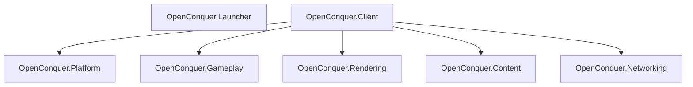

# OpenConquer Client

[](https://github.com/berniemackie97/OpenConquerClient/actions/workflows/ci.yml)

A C#/.NET 10 reconstruction of the Conquer Online 5517 client ecosystem for Windows, macOS, and
Linux, designed for OpenConquer Server.

**Early development. The launcher is not release-ready.**

## Current capabilities

| Product  | Implemented                                                                                                                                                                                                                                                                                                                                                                                                                | Still required                                                                                                                                                                      |
| -------- | -------------------------------------------------------------------------------------------------------------------------------------------------------------------------------------------------------------------------------------------------------------------------------------------------------------------------------------------------------------------------------------------------------------------------- | ----------------------------------------------------------------------------------------------------------------------------------------------------------------------------------- |
| Launcher | Avalonia host, redacted diagnostics, authenticated managed-package resolution, embedded publisher trust, release-signature and client-integrity verification, signed release-catalog selection, bounded HTTPS package acquisition, process-crash-safe client-generation update/repair and verified rollback transaction, installation recheck, single-instance activation, coordinated shutdown, saved display preferences | Production release origin/configuration and player-facing maintenance flow, launcher self-update, controlled verified client startup, complete player UX, signed platform packaging |
| Client   | Resizable/fixed/fullscreen host, logical rendering and presentation, verified bootstrap content                                                                                                                                                                                                                                                                                                                            | Networking, gameplay, higher-level rendering                                                                                                                                        |

The launcher replaces `Play.exe` as the product entry point. Launcher and client remain independent
executables and dependency boundaries. A managed product contains both; the launcher automatically
resolves its own installation and never asks the player to locate game files.

Opening the launcher again activates the existing window for the current user. See
[instance ownership](docs/architecture/launcher-instances.md) for startup and recovery behavior.

A resolved installation proves that the managed client is structurally valid, compatible with the
current platform and launcher, authenticated by a trusted publisher, and byte-for-byte consistent
with its signed release manifest. **Check again** re-evaluates an unavailable installation after its
files or permissions have been restored; it does not perform repair.

## Products and architecture



The launcher and game client are separate executable products. The client composes its runtime
subsystems; Platform and Rendering remain independent siblings.

The intended production lifecycle is:

```text
launcher → installation/readiness → update/repair as required → pre-launch settings
         → verified, authorized OpenConquer.Client startup
client   → realm selection → native AccountServer login → GameServer handoff → game
```

Authenticated installation readiness, signed release-catalog/package acquisition, and the trusted
client-generation update/repair transaction are implemented below the UI boundary. A real
publisher-controlled release origin and launcher configuration, launcher self-update, player-facing
maintenance orchestration, and controlled client startup remain separate launcher capabilities.

## Build and verify

Use the exact SDK in [`global.json`](global.json). Dependencies use committed NuGet lock files.

```bash
dotnet restore OpenConquer.Client.slnx --locked-mode
dotnet format OpenConquer.Client.slnx --verify-no-changes --no-restore
dotnet build OpenConquer.Client.slnx -c Release --no-restore
dotnet test OpenConquer.Client.slnx -c Release --no-build --no-restore
```

CI builds and tests on Linux, Windows, and macOS. The Linux quality job also checks formatting,
content integrity, independent publishes, authenticated release composition, launcher isolation, and
managed-product staging. Windows and macOS additionally execute the real OpenGL rendering
conformance boundary against the native desktop driver. CI does not replace platform packaging,
production signing, or notarization.

## Run

Create or refresh the canonical local managed product with:

```bash
dotnet run \
  --project tools/OpenConquer.Product.Tool \
  --configuration Release \
  -- \
  create-local-product
```

The command discovers the repository and current supported runtime, verifies and publishes the
client, creates an authenticated development release, publishes the launcher with matching
development trust embedded, stages the managed product, and activates it beneath:

```text
artifacts/local-product/product
```

Run the managed launcher on macOS/Linux with:

```bash
./artifacts/local-product/product/OpenConquer.Launcher
```

Use `artifacts\local-product\product\OpenConquer.Launcher.exe` on Windows.

A raw launcher project output has no installed client component and reports an unavailable
installation.

For direct client development:

```bash
dotnet run --project src/OpenConquer.Client -- \
  --window-size 1280x720 --window-mode resizable --presentation fit
```

| Client option    | Values                                                              |
| ---------------- | ------------------------------------------------------------------- |
| `--window-size`  | `WIDTHxHEIGHT`; default `1280x720`                                  |
| `--window-mode`  | `resizable` (default), `fixed`, `fullscreen`                        |
| `--presentation` | `fit` (default), `integer`, `stretch`                               |
| `--content-root` | Explicit authorized 5517 content tree; defaults to packaged content |

The current internal render surface is 800×600 or 1024×768, selected by compatibility
`ini/GameSetUp.ini`. Desktop size and mode are independent. Installed retail content is not
rewritten for player preferences. The launcher saves modern
[display preferences](docs/architecture/launcher-settings.md); delivery through controlled client
startup remains unimplemented.

## Compatibility rules

- Preserve verified 5517 AccountServer packets, credential transformations, cryptography, results,
  and game handoff semantics. Native/deob evidence and the current server contract must be audited
  before implementing protocol behavior. OAuth/OIDC is not a replacement for native login.
- Credentials and session material must not pass through arguments, environment variables, or
  plaintext temporary files. Account login and native game-session handoff belong to
  Client/Networking. Launcher startup authorization establishes product provenance, not account
  authentication.
- Keep the content manifest, runtime consumer closure, tracked payload, and client publish equal.
  The current bootstrap payload is `Logo1.bmp`, `Logo2.bmp`, `GameSetUp.ini`, `info.ini`, and
  `package.ini`; see the [content plan](docs/content/retail-5517-content-plan.md).
- Retail `Server.dat` remains offline compatibility evidence only and must not ship in the managed
  game client.

```text
ClientContentClosure
        ==
tracked content manifest
        ==
tracked runtime payload
        ==
published OpenConquer.Client content set
```

## Developer reference

| Need                                                            | Read                                                                                                                |
| --------------------------------------------------------------- | ------------------------------------------------------------------------------------------------------------------- |
| Build, run, local product, release tooling, content commands    | [Development](docs/development.md)                                                                                  |
| Product dependencies and ownership                              | [Architecture](docs/architecture/architecture.md)                                                                   |
| Package schema, authenticated resolution, composition, recovery | [Managed installation](docs/architecture/launcher-managed-installation.md)                                          |
| Native rendering behavior                                       | [Graphics compatibility](docs/compatibility/native-graphics.md)                                                     |
| Content provenance and ingestion                                | [Retail inventory](docs/content/retail-5517-inventory.md), [content plan](docs/content/retail-5517-content-plan.md) |

## Repository

```text
src/
├── OpenConquer.Client/
├── OpenConquer.Content/
├── OpenConquer.Gameplay/
├── OpenConquer.Launcher/
├── OpenConquer.Networking/
├── OpenConquer.Platform/
└── OpenConquer.Rendering/

tests/
├── Conformance/
│   └── OpenConquer.Rendering.Conformance/
├── OpenConquer.Client.Tests/
├── OpenConquer.Content.Tests/
├── OpenConquer.Content.Tool.Tests/
├── OpenConquer.Launcher.Tests/
├── OpenConquer.Platform.Tests/
├── OpenConquer.Product.Tool.Tests/
└── OpenConquer.Rendering.Tests/

content/
docs/
tools/
├── OpenConquer.Content.Tool/
└── OpenConquer.Product.Tool/
```
