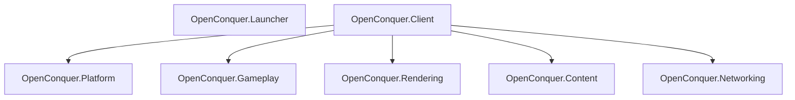

# OpenConquer Client

[](https://github.com/berniemackie97/OpenConquerClient/actions/workflows/ci.yml)

C#/.NET 10 reconstruction of the Conquer Online 5517 client ecosystem for Windows, macOS, and Linux.

**Early development. The launcher is not release-ready.**

## Current Capabilities

| Product | Implemented | Remaining |
| --- | --- | --- |
| Launcher | Managed installation resolution, authenticated releases, integrity verification, update/repair/rollback transaction, single-instance activation, saved display preferences | Production release origin, launcher self-update, player-facing maintenance flow, controlled client startup |
| Client | Desktop host, logical rendering/presentation, verified retail content, TGA/DXT3 sprites, native text rendering, static main-HUD chrome, life/mana/stamina vitals, skill/experience HUD, native 10-button action strip, four native main-HUD CMyCheck controls, 10-slot quickbar/grid, selected-skill image/cover, selected-skill cooldown text | Live gameplay state, downstream HUD-control side effects, status hints/tooltips, outer HUD gate, remaining UI, networking, maps, roles, effects, animation |

## Architecture


```mermaid
flowchart TD
    Launcher["OpenConquer.Launcher"]
    Client["OpenConquer.Client"]

    Client --> Platform["OpenConquer.Platform"]
    Client --> Gameplay["OpenConquer.Gameplay"]
    Client --> Rendering["OpenConquer.Rendering"]
    Client --> Content["OpenConquer.Content"]
    Client --> Networking["OpenConquer.Networking"]
```

Launcher and game client are separate products.

```text
launcher
→ installation readiness
→ update / repair
→ pre-launch settings
→ controlled client startup

client
→ realm selection
→ AccountServer login
→ GameServer handoff
→ game
```

## Build

Use the SDK pinned by [`global.json`](global.json).

```bash
dotnet restore OpenConquer.Client.slnx --locked-mode
dotnet format OpenConquer.Client.slnx --verify-no-changes --no-restore
dotnet build OpenConquer.Client.slnx -c Release --no-restore
dotnet test OpenConquer.Client.slnx -c Release --no-build --no-restore
```

CI builds and tests on Linux, Windows, and macOS.

Real-driver rendering conformance runs separately on supported desktop hardware against exact retail 5517 content.

## Run

Create or refresh the local managed product:

```bash
dotnet run \
  --project tools/OpenConquer.Product.Tool \
  --configuration Release \
  -- \
  create-local-product
```

Output:

```text
artifacts/local-product/product
```

macOS/Linux:

```bash
./artifacts/local-product/product/OpenConquer.Launcher
```

Windows:

```powershell
.\artifacts\local-product\product\OpenConquer.Launcher.exe
```

Direct client development:

```bash
dotnet run --project src/OpenConquer.Client -- \
  --window-size 1280x720 \
  --window-mode resizable \
  --presentation fit
```

Client options:

| Option | Values |
| --- | --- |
| `--window-size` | `WIDTHxHEIGHT`; default `1280x720` |
| `--window-mode` | `resizable`, `fixed`, `fullscreen` |
| `--presentation` | `fit`, `integer`, `stretch` |
| `--content-root` | Authorized retail-compatible content tree |

Logical rendering is restricted to 800×600 or 1024×768 according to `ini/GameSetUp.ini`.

Desktop size, window mode, and presentation are independent.

## Compatibility

Native 5517 behavior is the compatibility authority.

Preserve verified:

```text
protocol packets
credential transformations
cryptography
login results
game handoff semantics

logical rendering
content paths and lookup behavior
sprite behavior
HUD geometry and ordering
native UI state and input behavior
```

Do not preserve obsolete implementation machinery when observable behavior can be reproduced safely.

### Runtime Content

The managed runtime closure currently contains 3,775 files totaling 20,633,919 bytes.

The exact path set is authoritative in:

```text
content/retail-5517/manifest.json
content/retail-5517/payload
```

It currently covers:

```text
startup configuration
startup logos
ini/Font.ini
Control.ani

Progress45 HUD background
Dialog4 HUD panels

Progress40 life frames
Progress41 mana frames
Progress42 skill frames
Progress46 stamina frames
Progress47 extended-stamina frames

10-button main-HUD action strip
four native main-HUD CMyCheck controls

10-slot main-HUD quickbar/grid
fixed quickbar control artwork
action and dance families
magic and XP-magic families
item-min-icon families
verified glow families

Magic0 selected-skill image
Image0 selected-skill cover
selected-skill cooldown text configuration
```

Required invariant:

```text
ClientContentClosure
        ==
tracked manifest
        ==
tracked payload
        ==
published client content
```

The large closure is intentional: GFX-UI-006 introduced verified parametric quickbar consumers whose
ANI catalogs reference broad action, magic, item-icon, and glow families. The manifest, rather than a
hand-maintained Markdown file list, is the exact closure authority.

Retail WDF archives are import sources and are not shipped in the curated content set.

Retail `Server.dat` remains offline compatibility evidence and is not runtime content.

### HUD

Implemented main-HUD composition is:

```text
Progress45 background
Progress40 life
Progress41 mana
Progress46 stamina
Progress47 extended stamina
Dialog4 panels
Progress42 skill / experience
10-slot quickbar/grid
10-button action strip
four main-HUD CMyCheck controls
selected-skill image / previously armed cover
selected-skill cooldown text
```

The action strip reconstructs the verified native visual, state, timing, hit-test, capture, and
release behavior of its ten `CMyButton` controls.

Implemented action-strip behavior includes:

```text
native control IDs and draw order
46×22 logical hit rectangles
64×32 natural-size button sprites
ANI frame modulo behavior
enabled / pressed / disabled frame state
single-control pointer capture
inside-release activation
outside-release cancellation
PK skin selection
PK timed blinking
Organise timed blinking
```

Action-button activation results are not yet connected to downstream gameplay dialogs, networking,
or other feature behavior. Those dependencies are implemented only after their own native contracts
are verified.

The neighboring native `CMyCheck` group currently reconstructs:

```text
Check40   0x3F4  walk/run
Check43   0x3F7  map
Check46   0x3FF  screen shift
Button411 0x3F8  equipment view

22×22 logical hit rectangles
32×32 natural-size ANI sprites
state 0 / state 1 rendering
state transition on delivered left-button down
left/top inclusive, right/bottom exclusive hit testing
native draw order after the ten CMyButton controls
```

GFX-UI-006 adds the native ten-slot quickbar/grid boundary:

```text
control ID 0x3FD
1 row × 10 columns
local origin (90,98)
40×40 visual cells
41-pixel horizontal input stride

item
action
magic
XP magic
dance
weapon swap

hover / activation / pickup state
quantities and upgrade markers
covers and cooldown state
animated glow families
```

GFX-UI-007 adds the selected-skill boundary:

```text
control ID 0x3FE
initial ANI section Magic0
local origin (753,96)
47×46 destination
50×50 selected-image source
64×64 Image0 cover source

selected image
previously armed cover
cooldown text
```

The cooldown routine intentionally mutates the selected-image cover flag after the image draw. A
continuing cooldown therefore renders the currently armed cover, draws the cooldown number, and
re-arms the cover for the following frame. This one-frame state behavior is preserved rather than
normalized into a stateless overlay.

Quickbar contents, selected-skill identity, and cooldown time currently expose Client-owned consumer
state seams. Live Gameplay producers remain deferred.

The check controls likewise do not invent downstream map, screen-shift, equipment-view, or other
feature effects. Native USER32 release/`BN_CLICKED` behavior outside the proven state-transition
boundary remains deferred.

The next unimplemented main-HUD visual slice is status hints/tooltips, followed by the outer HUD
gate. Those features are implemented only after their own native behavior and dependencies are
verified.

## Repository

```text
src/
├── OpenConquer.Client/
├── OpenConquer.Content/
├── OpenConquer.Gameplay/
├── OpenConquer.Launcher/
├── OpenConquer.Networking/
├── OpenConquer.Platform/
└── OpenConquer.Rendering/

tests/
├── Conformance/
│   └── OpenConquer.Rendering.Conformance/
├── OpenConquer.Client.Tests/
├── OpenConquer.Content.Tests/
├── OpenConquer.Content.Tool.Tests/
├── OpenConquer.Launcher.Tests/
├── OpenConquer.Platform.Tests/
├── OpenConquer.Product.Tool.Tests/
└── OpenConquer.Rendering.Tests/

content/
docs/

tools/
├── OpenConquer.Content.Tool/
└── OpenConquer.Product.Tool/
```

## Documentation

| Area | Document |
| --- | --- |
| Development | [`docs/development.md`](docs/development.md) |
| Architecture | [`docs/architecture/architecture.md`](docs/architecture/architecture.md) |
| Managed installation | [`docs/architecture/launcher-managed-installation.md`](docs/architecture/launcher-managed-installation.md) |
| Native graphics | [`docs/compatibility/native-graphics.md`](docs/compatibility/native-graphics.md) |
| Native text | [`docs/compatibility/native-text.md`](docs/compatibility/native-text.md) |
| Retail content | [`docs/content/retail-5517-content-plan.md`](docs/content/retail-5517-content-plan.md) |
| Retail inventory | [`docs/content/retail-5517-inventory.md`](docs/content/retail-5517-inventory.md) |
