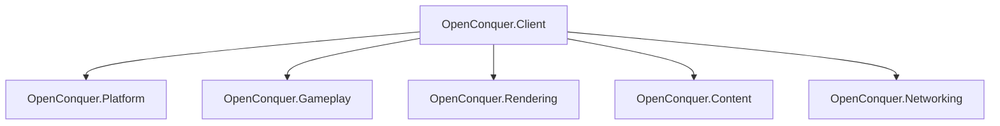
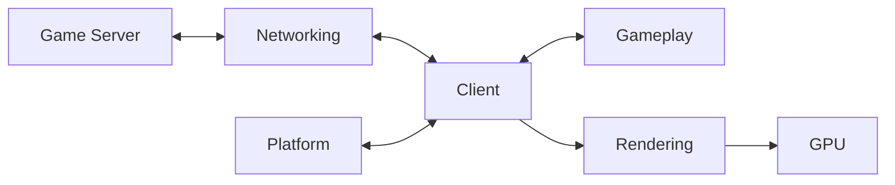
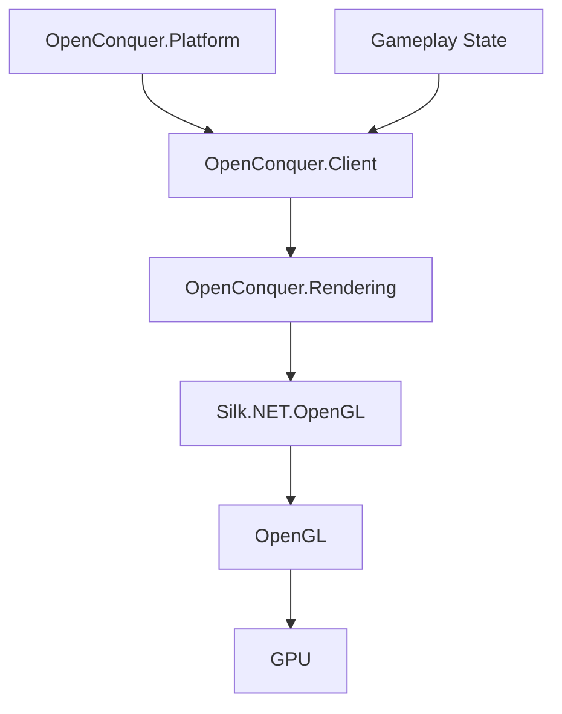

# Client Architecture

This document describes the high-level architecture of OpenConquer Client for contributors and
developers interested in the project.

It is intentionally focused on subsystem boundaries, dependencies, and ownership. More detailed
designs should live beside the subsystem they describe.

## Projects



`OpenConquer.Client` is the composition root. The subsystem projects are kept independent unless a
real ownership or behavioral requirement requires a dependency between them.

In particular, `OpenConquer.Platform` and `OpenConquer.Rendering` are sibling subsystems and do not
reference one another.

## Responsibilities

| Project                  | Owns                                                                                        |
| ------------------------ | ------------------------------------------------------------------------------------------- |
| `OpenConquer.Client`     | process entry point, subsystem composition, application lifetime, and shutdown coordination |
| `OpenConquer.Platform`   | desktop windowing, graphics-context lifetime, framebuffer state, and presentation           |
| `OpenConquer.Gameplay`   | game state, entities, movement, combat, interactions, and gameplay rules                    |
| `OpenConquer.Rendering`  | OpenGL integration, rendering, cameras, shaders, GPU resources, and render targets          |
| `OpenConquer.Content`    | client filesystem behavior, legacy formats, decoding, loading, and content lookup           |
| `OpenConquer.Networking` | connections, transport, encryption, packet framing, protocol encoding, and decoding         |

Platform-specific window and context types remain inside `OpenConquer.Platform`. Rendering owns
graphics behavior and GPU resources without depending on the windowing subsystem.

## Runtime Flow

The intended runtime flow is directional, with `OpenConquer.Client` coordinating the independent
subsystems.



The application begins and ends in `OpenConquer.Client`. Platform provides the desktop runtime,
Networking communicates with the server, Gameplay owns simulation state, and Rendering consumes the
state required to produce a frame.

## Platform Boundary

`OpenConquer.Platform` owns behavior whose semantics come from the desktop environment:

* native window creation and destruction
* OpenGL context creation and lifetime
* framebuffer dimensions
* presentation
* focus and window state
* desktop input when introduced

Silk.NET windowing and input types must not leak into Gameplay, Rendering, Content, or Networking.

`OpenConquer.Client` depends on Platform as a consumer and composition root rather than implementing
platform behavior itself.

## Rendering Boundary



Platform owns the native window and OpenGL context. Rendering owns the OpenGL API binding and GPU
resources. Client is responsible for composing those lifetimes without creating a direct dependency
between Platform and Rendering.

### OpenGL Bootstrap

The native OpenGL context is owned by `OpenConquer.Platform`.

Once the desktop window has initialized its graphics context, Platform exposes a narrow borrowed
`IOpenGlContext` capability to `OpenConquer.Client`. Silk.NET window and context types remain
internal to Platform.

Client bridges the Platform-owned context into Rendering through an OpenGL procedure-address
resolver:

```text
OpenConquer.Platform
        │
        │ IOpenGlContext.GetProcAddress
        ▼
OpenConquer.Client
        │
        │ OpenGlProcAddressResolver
        ▼
OpenConquer.Rendering
        │
        │ GL.GetApi(...)
        ▼
Silk.NET.OpenGL
```

`OpenConquer.Rendering` therefore does not depend on `OpenConquer.Platform`,
`Silk.NET.Windowing`, or Silk.NET context types.

`OpenGlGraphicsDevice` owns the OpenGL API binding but does not own the native OpenGL context.

During shutdown, Platform ensures that the context remains valid and current while Client releases
the graphics device and its GPU resources.

The intended graphics lifetime is:

```text
Create:

window / OpenGL context
        ↓
OpenGL API binding
        ↓
GPU resources


Destroy:

GPU resources
        ↓
OpenGL API binding
        ↓
OpenGL context
        ↓
window
```

GPU resources must be destroyed while the graphics context required to destroy them is still valid.

## Dependency Rules

Dependencies are introduced only when a subsystem genuinely requires another subsystem's behavior or
ownership.

The current architecture follows these rules:

* `OpenConquer.Client` is the sole composition root.
* `OpenConquer.Platform` does not reference `OpenConquer.Rendering`.
* `OpenConquer.Rendering` does not reference `OpenConquer.Platform`.
* `OpenConquer.Rendering` does not depend on Silk.NET Windowing or Input.
* `OpenConquer.Client` does not directly depend on Silk.NET.
* `OpenConquer.Gameplay` remains independent of platform, graphics, and transport infrastructure.
* `OpenConquer.Content` remains independent of graphics and gameplay behavior.
* `OpenConquer.Networking` remains independent of platform and rendering concerns.

A project is an ownership and dependency boundary, not a replacement for a folder.
