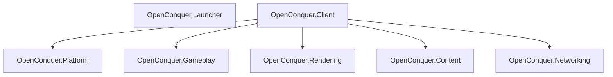
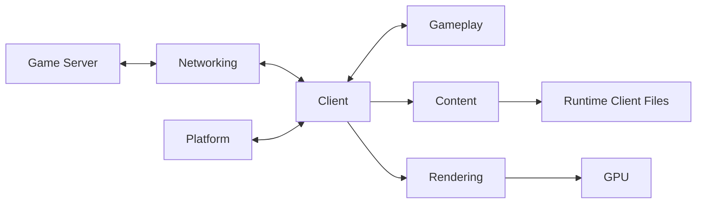
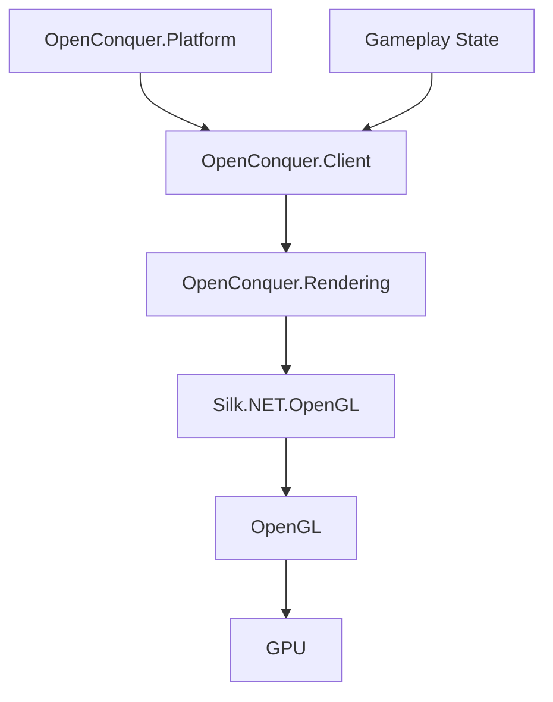

# Client Architecture

This document describes the high-level architecture of OpenConquer Client for contributors and
developers interested in the project.

It is intentionally focused on product boundaries, subsystem boundaries, dependencies, ownership,
and lifetime.

Compatibility-specific native graphics requirements are documented separately. Historical
`Server.dat` evidence is documented separately because that format is retained by offline tooling,
not by the modern client runtime.

## Products and Projects

The repository now contains two independent executable products:

- `OpenConquer.Launcher`
- `OpenConquer.Client`

They are separate process and composition boundaries. The launcher is not a wrapper assembly around
the game client, and the game client is not a reusable library for the launcher.



`OpenConquer.Launcher` is its own executable composition root.

`OpenConquer.Client` is the sole game-runtime composition root. Game subsystem projects remain
independent unless a real ownership or behavioral requirement justifies a dependency between them.

There is deliberately no project-reference edge from `OpenConquer.Launcher` to `OpenConquer.Client`,
`OpenConquer.Platform`, `OpenConquer.Rendering`, `OpenConquer.Content`, `OpenConquer.Gameplay`, or
`OpenConquer.Networking`.

In particular, `OpenConquer.Platform` and `OpenConquer.Rendering` are sibling game-runtime
subsystems and do not reference one another.

Offline development and compatibility tooling is not part of either product's runtime dependency
graph.

## Responsibilities

| Project                  | Owns                                                                                                                                                                                     |
| ------------------------ | ---------------------------------------------------------------------------------------------------------------------------------------------------------------------------------------- |
| `OpenConquer.Launcher`   | launcher process entry point, Avalonia application lifetime, launcher-window shell, future account/update/repair composition, and future authorized game-start orchestration             |
| `OpenConquer.Client`     | game process entry point, startup-option validation, compatibility-derived runtime policy, game-subsystem composition, application lifetime, and shutdown coordination                   |
| `OpenConquer.Platform`   | desktop windowing, native graphics-context lifetime, physical framebuffer state, desktop frame-loop orchestration and pacing mechanics, native buffer swapping, and future desktop input |
| `OpenConquer.Gameplay`   | game state, entities, movement, combat, interactions, and gameplay rules                                                                                                                 |
| `OpenConquer.Rendering`  | OpenGL integration, logical rendering, logical-to-host framebuffer composition, cameras, shaders, GPU resources, and render targets                                                      |
| `OpenConquer.Content`    | runtime client-root filesystem semantics, required legacy configuration and formats, decoding, loading, and content lookup                                                               |
| `OpenConquer.Networking` | game connections, transport, encryption, packet framing, protocol encoding, and decoding                                                                                                 |

Platform-specific window and context types remain inside `OpenConquer.Platform`. Rendering owns
graphics behavior and GPU resources without depending on the windowing subsystem.

Compatibility-derived game policy remains in `OpenConquer.Client`. Platform implements the desktop
mechanism required to apply that policy without knowing why a particular value was chosen.

Launcher UI and launcher process lifetime belong to `OpenConquer.Launcher`. They do not move into
the game's Platform project merely because both products have desktop windows.

Historical formats that have no production runtime consumer do not remain in runtime assemblies
merely because they are useful reconstruction evidence.

## Launcher Product Boundary

`OpenConquer.Launcher` is a .NET 10 desktop executable using Avalonia.

The current launcher foundation contains only the product shell:

```text
Program
    │
    ▼
Avalonia AppBuilder
    │
    ▼
App
    │
    ▼
MainWindow
```

`Program` owns process startup and explicitly uses `ShutdownMode.OnMainWindowClose`.

The main-window lifetime is therefore the current launcher-process lifetime. Closing the primary
launcher window terminates the launcher rather than allowing an unrelated auxiliary window to keep
the process alive accidentally.

If a future product requirement introduces tray behavior, background patching, or another
long-running launcher mode, that lifetime policy must change explicitly rather than emerging from
additional windows.

The launcher currently uses:

```text
Avalonia
Avalonia.Desktop
Avalonia.Themes.Fluent
```

It deliberately does not currently depend on:

```text
Silk.NET
OpenConquer.Client
OpenConquer.Platform
OpenConquer.Rendering
OpenConquer.Content
OpenConquer.Gameplay
OpenConquer.Networking
```

The launcher foundation also deliberately introduces no speculative:

- account-authentication implementation;
- OAuth/OIDC client;
- registration or recovery UI;
- token cache;
- credential store;
- HTTP service layer;
- updater;
- repair system;
- launcher-to-game IPC;
- game-process launcher;
- launch grant;
- realm model;
- realm discovery;
- realm routing;
- legacy server connection profile.

Those concerns require separately audited boundaries when their actual contracts are introduced.

The launcher currently has a minimal presentation shell rather than placeholder feature screens.
Feature UI should follow implemented product state and service contracts rather than inventing fake
login, update, or realm workflows ahead of their architecture.

## Product Publish Boundary

Building an executable and publishing an executable are treated as different product guarantees.

CI publishes both executable products independently.

The game-client publish must contain the exact verified retail runtime content closure:

```text
data/main/Logo1.bmp
data/main/Logo2.bmp
ini/GameSetUp.ini
ini/info.ini
ini/package.ini
```

The published client is additionally checked for any `Server.dat` anywhere beneath the publish root.

The launcher publish is separately checked to ensure it does not acquire:

```text
content/retail-5517
```

The intended product relationship is therefore not:

```text
launcher package
└── game runtime internals and retail content
```

Instead each executable has its own publish boundary:

```text
OpenConquer.Launcher publish
        │
        └── launcher runtime only

OpenConquer.Client publish
        │
        └── exact game runtime content closure
```

Runtime-identifier-specific packages, installers, code signing, notarization, self-contained
deployment, and operating-system-native bundles remain future release-engineering concerns.

## Game Runtime Flow

The game runtime flow is directional, with `OpenConquer.Client` coordinating independent game
subsystems.



The game process begins and ends in `OpenConquer.Client`. Platform provides the game desktop
runtime, Content provides access to required legacy client data, Networking communicates with game
servers, Gameplay owns simulation state, and Rendering consumes the state required to produce a
frame.

`OpenConquer.Launcher` is not part of this steady-state game-subsystem graph.

The future launcher-to-game authorization transition will cross a process boundary. It must not be
implemented as a direct launcher reference to game runtime internals.

A historical retail file is not automatically part of this runtime flow. Compatibility evidence may
instead terminate at an offline tool or parity test.

## Startup and Content Boundary

Game startup configuration belongs to the game executable composition boundary rather than to
Content, Platform, or Rendering.

`ClientStartupOptions` interprets the currently supported game-process arguments before the
application is created.

The supported startup form is:

```text
OpenConquer.Client [--content-root <path>] [--presentation <fit|integer|stretch>]
```

With no explicit content root, startup uses the versioned `content/retail-5517/payload` set staged
under `AppContext.BaseDirectory`, making content discovery deterministic relative to the executable
rather than dependent on the process working directory.

An explicit `--content-root` may be absolute or relative. Relative overrides are resolved against
the process working directory at startup and normalized to an absolute path.

Malformed startup input is rejected before application construction. Unknown arguments, duplicate
content-root declarations, and missing content-root values are not silently ignored.

The resulting content-root path and presentation policy are passed into `ClientApplication`. The
application constructs the composite `PackagedClientContentSource`; Content does not depend on or
receive the executable's complete startup-options object.

```text
process arguments
        │
        ▼
ClientStartupOptions
        │
        ├── absolute ContentRootPath
        └── PresentationPolicy
                │
                ▼
        ClientApplication
                │
                ▼
    PackagedClientContentSource
        │
        ├── loose files through ClientContentRoot
        └── package entries through WdfArchive
```

Direct game-process startup remains available for development and reconstruction work.

It is not the intended final production account-authentication mechanism. Future production startup
will introduce an explicit authorized launcher-to-game transition without using ordinary process
arguments as a bearer-token transport.

`ClientContentRoot` establishes the legacy client filesystem boundary.

It:

- requires an existing, inspectable root directory
- rejects a content root that is a symbolic link or reparse point
- accepts legacy `/` and `\` separators
- resolves path segments case-insensitively to preserve Windows-era client lookup semantics on
  case-sensitive filesystems
- rejects rooted content paths
- rejects `.` and `..` traversal segments
- rejects symbolic links and reparse points at every resolved content-path segment
- rejects ambiguous case-insensitive matches instead of selecting one nondeterministically
- distinguishes optional lookup from required-file lookup

The content boundary does not permit filesystem indirection through symbolic links, junctions, or
other reparse points. A resolved content path therefore cannot escape the configured client root
through a linked child entry.

Filesystem metadata, enumeration, and I/O failures are not converted into false "not found" results.
In particular, inaccessible or otherwise unreadable content roots preserve their underlying
filesystem failure instead of being misreported as missing directories.

The first production consumer of this boundary is the retail screen-mode configuration.

At startup, `GameSetupConfiguration` resolves:

```text
ini/GameSetUp.ini
```

and reads:

```ini
[ScreenMode]
ScreenModeRecord=<value>
```

Legacy section and key matching are case-insensitive. The file is read using Latin-1-compatible text
decoding appropriate for the legacy client data.

The verified retail screen-mode mapping is:

| ScreenMode | Logical resolution |
| ---------: | -----------------: |
|          0 |            800×600 |
|          1 |            800×600 |
|          2 |           1024×768 |
|          3 |           1024×768 |

Missing configuration, a missing screen-mode value, or a value outside the verified range fails
startup explicitly rather than inventing unsupported fallback behavior.

The Content project interprets the legacy configuration. It does not construct Rendering types.
`ClientApplication` bridges the resulting dimensions into `LogicalRenderSize`, preserving the
dependency boundary between Content and Rendering.

### Retail Content Closure

The versioned retail runtime payload is consumer-led rather than a bulk client-tree mirror.

`ClientContentClosure` defines the exact paths required by implemented runtime consumers, and the
import and verification tooling requires that code closure, manifest path set, and physical payload
path set remain identical.

The current retail-5517 runtime closure contains exactly:

```text
data/main/Logo1.bmp
data/main/Logo2.bmp
ini/GameSetUp.ini
ini/info.ini
ini/package.ini
```

A retail file enters that closure only with an implemented, reviewed runtime consumer.

Large WDF archives remain outside it because no implemented runtime consumer requires an archive
entry. `ini/package.ini` remains inside the closure because package declaration and routing behavior
are implemented and observable even when the declared archives themselves are absent.

Historical compatibility fixtures are separate from this equality.

Retail `Server.dat`, for example, is preserved under the content-tool test tree but is deliberately
absent from:

```text
ClientContentClosure
content/retail-5517/payload
content/retail-5517/manifest.json
published OpenConquer.Client runtime content
```

### Legacy Server.dat Tooling Boundary

Native 5517 used a loose-root `Server.dat` file for the historical login/server-selection bootstrap.

That format remains valuable reconstruction and protocol evidence, but it is not the production
configuration model for the modern client.

The retained ownership is:

```text
tests/OpenConquer.Content.Tool.Tests/TestData/retail-5517/Server.dat
        │
        ▼
OpenConquer.Content.Tool.Legacy.ServerDat
        │
        ├── ServerDatFileReader
        ├── ServerDatEnvelopeDecoder
        ├── ServerDatNativePublicKey
        └── ServerDatXmlCatalogReader
                │
                ▼
        historical ServerDatCatalog
```

This boundary is intentionally outside `OpenConquer.Content`.

The file reader accepts one explicit filesystem path. It does not use:

- `IClientContentSource`;
- `ContentLookupMode`;
- loose/package runtime fallback;
- WDF routing;
- a runtime server directory abstraction.

The hardened decoder preserves the verified native RSA/PKCS#1/gzip envelope and the verified
`outenserver` XML structure while applying explicit modern resource-safety limits.

The historical model preserves source semantics including:

```text
FlashName
FlashIcon
FlashHint
ServerName
ServerIP
ServerPort
```

It deliberately does not normalize those fields into modern concepts such as `Realm`, `Host`, or
`Endpoint`.

The exact retail data proves that this distinction matters: multiple rows have different `FlashName`
and `ServerName` values.

The retained exact fixture resolves to 14 groups and 94 server rows.

Detailed evidence and security interpretation are documented in
[`docs/compatibility/server-dat.md`](../compatibility/server-dat.md).

### Authentication and Realm Direction

The modern production architecture does not use a locally shipped server list as its trust or
routing boundary.

The first process boundary required for that architecture now exists:

```text
OpenConquer.Launcher
        │
        │ future authorized transition
        ▼
OpenConquer.Client
```

Only the executable/product boundary is implemented in the current launcher foundation.

Account authentication, launch authorization, launcher-to-game handoff, authenticated realm
discovery, realm selection, and realm routing have not yet been implemented.

The intended high-level lifecycle remains:

```text
launcher authentication
        ↓
one-time game launch authorization
        ↓
authenticated game session
        ↓
realm discovery
        ↓
select stable RealmId
        ↓
server-authoritative route and short-lived connection authorization
        ↓
realm ingress
```

The future authorization protocol, launcher-to-game handoff mechanism, service contracts,
credential/session-storage policy, and realm-domain types remain implementation-slice decisions and
must be audited when introduced.

The launcher foundation must not be mistaken for an authorization implementation merely because the
launcher executable now exists.

The important boundaries established so far are:

- launcher and game are separate executable products;
- the launcher does not reference game runtime subsystem assemblies;
- the launcher does not ship the game's retail runtime content closure;
- the game runtime does not trust or consume retail `Server.dat`;
- player-facing realm identity is not an IP address and port;
- historical `ServerName` semantics remain at compatibility/protocol boundaries rather than becoming
  the modern realm-domain identity;
- account-aware realm discovery and routing belong to authenticated server-controlled boundaries.

Future launcher account authentication should use an appropriate native-application authorization
flow rather than collecting account passwords into an invented local protocol.

Long-lived account credentials or launcher bearer tokens must not be passed into
`OpenConquer.Client` through command-line arguments, environment variables, or temporary plaintext
files.

The precise secure handoff mechanism is intentionally not selected by this foundation slice.

## Startup Logo Lifetime

The retail logo is an optional initialization surface, not content in the main game framebuffer.

Startup reads `ini/info.ini[DlgLogo]BgFormat` through the loose-filesystem path used by the native
INI loader, selects variant 1 or 2 from the monotonic tick parity, and attempts to decode the
selected 24-bit bitmap. Package lookup is not used for the startup logo.

The logo boundary deliberately preserves the native non-fatal behavior. A missing configuration file
falls back to the verified retail format, while an unusable format, unsafe resolved path, missing
bitmap, inaccessible bitmap, or bitmap-decoding failure makes the visual splash unavailable without
aborting client startup.

When no image is available, `OpenGLStartupSplash` creates no native window or OpenGL context.

When an image is available, `OpenConquer.Client` composes a dedicated borderless `StartupWindow`
with a dedicated Rendering device and startup renderer. The window's logical dimensions are the
bitmap's natural dimensions. On scaled displays the physical framebuffer may be larger, and the
startup renderer accounts for that framebuffer scaling while preserving the image's natural logical
size.

The lifetime order is a tested invariant:

```text
load startup configuration and optional bitmap
        ↓
if no usable bitmap: continue without a startup window
        ↓
if usable: create borderless startup window and OpenGL context
        ↓
present the selected logo once
        ↓
perform synchronous runtime initialization
        ↓
destroy startup renderer, context, and window
        ↓
construct main DesktopWindow
        ↓
create the main logical renderer
```

There is no artificial minimum splash duration. Native evidence shows no sleep, wait, timer, or
minimum-presentation interval between initialization and destruction of the startup logo. The modern
client therefore presents the surface and lets real synchronous initialization determine its
lifetime rather than introducing an invented delay.

The main `OpenGLRenderer` has no startup-logo resource or draw path. This keeps startup resources
out of steady-state rendering and preserves the native separation between the one-shot
initialization surface and the main client window.

## Platform Boundary

`OpenConquer.Platform` owns behavior whose semantics come from the game desktop environment:

- native startup and main-window creation and destruction
- OpenGL context creation and lifetime
- physical framebuffer dimensions
- desktop frame-loop orchestration
- frame-pacing mechanics
- native host-buffer swapping
- focus and window state
- desktop input when introduced

Silk.NET windowing and input types must not leak into Gameplay, Rendering, Content, or Networking.

`OpenConquer.Client` depends on Platform as a consumer and game composition root rather than
implementing platform behavior itself.

`OpenConquer.Launcher` does not depend on this game Platform project. Avalonia owns the launcher's
desktop UI mechanism.

Framebuffer dimensions are represented by `PixelSize`. Zero-sized dimensions are valid because a
desktop framebuffer may temporarily have no drawable area while minimized. Negative dimensions are
rejected at the type boundary.

## Desktop Frame Cadence

The outer client frame cadence is an application compatibility policy rather than an intrinsic
Platform or Rendering constant.

Verified retail behavior gates the outer client frame pipeline on a 25 ms interval. The modern
client therefore defines that interval in `ClientApplication` and supplies it when constructing
`DesktopWindow`.

```text
ClientApplication
        │
        │ retail frame interval: 25 ms
        ▼
DesktopWindow
        │
        │ frame-loop orchestration
        ▼
DesktopFramePacer
        │
        │ monotonic elapsed-time measurement
        │ remaining-interval wait
        ▼
next desktop frame
```

`DesktopFramePacer` is an internal Platform mechanism. It has no Conquer-specific timing constant
and operates only on the interval supplied by its caller.

The pacer uses a monotonic `TimeProvider` timestamp source. A frame that completes early waits for
the remainder of its interval. If work overruns the interval, the next frame proceeds without an
additional wait.

Missed intervals are not replayed. After an overrun, the actual next frame becomes the new cadence
anchor instead of running multiple catch-up frames.

Sleep completion is not assumed to be exact. The pacer rechecks elapsed monotonic time after every
wait, allowing it to handle early wakeups and scheduler oversleep without relying on nominal sleep
duration.

Silk.NET's own render and update frequency limiters remain uncapped because OpenConquer owns the
outer loop cadence explicitly through the lower-level custom view loop. Applying both pacing layers
would create competing timing policies.

Desktop events are processed before frame pacing so native window state is serviced before update
and rendering work for the next frame.

This cadence is not a gameplay simulation clock and must not become one implicitly. Future gameplay
simulation, startup-host timers, networking deadlines, animation clocks, and other timing domains
remain separate unless native behavior proves they share this contract.

## Rendering Boundary



Platform owns the native window and OpenGL context. Rendering owns the OpenGL API binding and GPU
resources. Client composes those lifetimes without creating a direct dependency between Platform and
Rendering.

Rendering also owns the logical-to-host framebuffer composition step. Platform owns the subsequent
native buffer swap.

### OpenGL Bootstrap

The native OpenGL context is owned by `OpenConquer.Platform`.

Once the desktop window has initialized its graphics context, Platform exposes a narrow borrowed
`IOpenGLContext` capability to `OpenConquer.Client`. Silk.NET window and context types remain
internal to Platform.

Client bridges the Platform-owned context into Rendering through an OpenGL procedure-address
resolver:

```text
OpenConquer.Platform
        │
        │ IOpenGLContext.GetProcAddress
        ▼
OpenConquer.Client
        │
        │ OpenGLProcAddressResolver
        ▼
OpenConquer.Rendering
        │
        │ GL.GetApi(...)
        ▼
Silk.NET.OpenGL
```

`OpenConquer.Rendering` therefore does not depend on `OpenConquer.Platform`, `Silk.NET.Windowing`,
or Silk.NET context types.

`OpenGLGraphicsDevice` owns the Silk.NET OpenGL API binding but does not own the native OpenGL
context.

Graphics-device initialization verifies that the active context satisfies the renderer's OpenGL 3.3
Core requirement. The device also captures the runtime OpenGL, GLSL, vendor, and renderer identity
for diagnostics and compatibility reporting.

Platform guarantees that the OpenGL context exists and is current when graphics initialization,
frame rendering, and graphics shutdown callbacks execute.

## Logical Rendering and Host Composition

The logical game surface is independent of the physical desktop framebuffer.

`OpenConquer.Rendering` receives an explicit `LogicalRenderSize` selected by the application.
Logical dimensions must be positive.

The application obtains the logical size from the verified retail `ScreenMode` value in
`ini/GameSetUp.ini`. Modes 0 and 1 select 800×600; modes 2 and 3 select 1024×768.

Rendering does not read legacy configuration and does not derive the logical size from the desktop
window.

`OpenConquer.Platform` separately reports the physical framebuffer through `PixelSize`. Its
dimensions change as the resizable host window changes.

```text
GameSetUp.ini
        │
        │ ScreenMode
        ▼
GameSetupConfiguration
        │
        │ 800×600 or 1024×768
        ▼
LogicalRenderSize
        │
        ▼
OpenGLRenderTarget
        │
        │ render logical frame
        ▼
fixed logical framebuffer
        │
        │ PresentationViewport places the frame
        │ OpenGLRenderer color blit
        ▼
physical host framebuffer
        │
        │ Platform native buffer swap
        ▼
desktop window
```

The distinction is intentional:

- logical dimensions define the game rendering coordinate space
- physical framebuffer dimensions define only the host composition destination
- resizing the desktop window does not change the logical game resolution
- minimizing the host may temporarily produce a zero-sized physical framebuffer without changing the
  logical render target

The original 5517 client supports four screen modes spanning 800×600 and 1024×768 logical
resolutions. The modern client preserves the verified logical-resolution selection while
intentionally retaining its resizable desktop-host policy.

The shell behavior associated with retail modes 1 and 3 is not inferred by Rendering from the mode
integer. Desktop-window behavior remains a Platform/application policy separate from logical
rendering resolution.

The desktop host is intentionally resizable. This is a modernization over the original fixed-window
behavior while preserving the game's fixed logical rendering coordinate system.

### Presentation transform

`PresentationViewport` is the single definition of where the logical frame lands inside the host
framebuffer. `OpenGLRenderer` blits into the rectangle it describes, and input maps pointer
positions back through `PresentationViewport.TryMapToLogical`. Deriving those two independently is
how a client draws in one place and resolves clicks in another, so neither side computes its own.

The transform holds no graphics-API type and is unit tested without a device.

`PresentationPolicy` selects how the frame is fitted:

| Policy          | Placement                                                                                                            | Filter                                                               |
| --------------- | -------------------------------------------------------------------------------------------------------------------- | -------------------------------------------------------------------- |
| `Fit` (default) | largest uniform scale that fits, centred                                                                             | point when the result is an exact whole multiple, otherwise bilinear |
| `IntegerScale`  | largest whole-number scale that fits, centred; falls back to `Fit` when the window is smaller than one logical frame | point                                                                |
| `Stretch`       | fills the host framebuffer                                                                                           | bilinear unless the result happens to be exact                       |

`Fit` and `IntegerScale` preserve the logical aspect ratio and leave pillarbox or letterbox bars.
`Stretch` is retained only as an explicit opt-in: a 4:3 logical frame across a 16:9 host is
stretched about 1.33x horizontally, so it is never the default.

Point sampling is chosen from the resulting rectangle rather than from the policy, so a `Fit` window
that lands on an exact whole multiple gets the sharper result too.

The policy is selected with the `--presentation fit|integer|stretch` startup option.

Because an aspect-preserving rectangle does not cover the whole host framebuffer, `OpenGLRenderer`
clears the host framebuffer before blitting whenever bars are present. The bars are never written by
the blit and would otherwise show whatever the swap chain left behind.

Positions inside a bar are not positions in the game world. `TryMapToLogical` reports them as
unmapped rather than clamping them to the nearest edge.

### Pointer mapping

Two conversions sit between a pointer and a logical pixel, and both are owned rather than left to
call sites.

```text
pointer position (window coordinates, top-down)
        │
        │ DesktopWindow.PointToFramebuffer
        ▼
host framebuffer pixels (top-down)
        │
        │ PresentationViewport.TryMapPointerToLogical
        ▼
logical pixel (top-down), or unmapped
```

`DesktopWindow.PointToFramebuffer` delegates to the windowing layer rather than deriving a size
ratio. Window coordinates and framebuffer pixels are the same only at a scale factor of one, and a
transform built from `FramebufferSize` without this conversion resolves clicks at a fraction of
their true position. That defect is invisible on an unscaled display.

The coordinate space the input layer reports was measured rather than assumed. On a 2x display, a
640x480 window reports a 1280x960 framebuffer, and with the operating-system cursor at global
position (965.2, 700.7):

```text
window.PointToClient(cursor)     = (915, 639)
IMouse.Position                  = (915.2422, 638.7461)   <- matches, within rounding
PointToFramebuffer(915, 639)     = (1830, 1278)           <- does not match
```

Pointer positions therefore arrive in window coordinates, and the conversion is required rather than
optional. `PointToFramebuffer` was also confirmed to be exactly linear and origin-preserving on that
display: `(0,0)` maps to `(0,0)`, `(1,1)` to `(2,2)`, and `(640,480)` to `(1280,960)`.

Reproduce by creating a window, reading `Size` and `FramebufferSize`, then comparing
`IMouse.Position` against `PointToClient` of the operating-system cursor position. A machine at a
scale factor of one cannot distinguish the two spaces and will not detect a regression here.

Pointer positions are fractional and the windowing conversion accepts whole window coordinates only,
so `PointToFramebuffer` rounds to the nearest rather than truncating, which would bias every pointer
up and to the left by half a window coordinate. Pointer precision is bounded at one window
coordinate, finer than the logical pixels it maps to.

`TryMapPointerToLogical` flips vertically at both ends: once to reach the bottom-up framebuffer row
the destination rectangle is expressed in, and once to return a top-down logical row. Performing
only the first mirrors every position about the horizontal centre — every position still maps
successfully, so only an ordering check detects it.

`TryMapFramebufferPointToLogical` is the bottom-up form, for framebuffer-space work. The two are
named apart so neither origin can be assumed from a signature.

A position inside a letterbox bar is not a position in the game world. Both methods report it as
unmapped rather than clamping it to the nearest edge.

Under minification some logical pixels have no pointer position that resolves to them: a window
smaller than the logical frame has fewer destination pixels than logical ones. This is inherent to
downscaling rather than an off-by-one, and it bounds pointer precision at small window sizes.

## Logical Render Target

`OpenGLRenderTarget` owns the logical framebuffer and its GPU attachments:

```text
logical framebuffer
├── RGB565 preferred / RGB5 fallback color texture
└── 16-bit depth renderbuffer
```

The logical target intentionally has no stencil attachment.

The render target preserves the verified retail 5517 16-bit color and depth contracts. Rendering
prefers an actual 5/6/5/0 color allocation and falls back to an actual 5/5/5/0 allocation. Requested
color formats are accepted only after OpenGL reports the expected component sizes, and the depth
renderbuffer is accepted only when OpenGL reports exactly 16 depth bits.

Frame initialization establishes deterministic full-target clear state. Scissoring is disabled,
color and depth writes are enabled, the color buffer is cleared to opaque black, and the depth
buffer is cleared to `1.0`.

OpenGL dithering is explicitly disabled for logical framebuffer rendering to preserve the verified
retail 16-bit rendering behavior rather than inheriting OpenGL's default dithering state.

The native evidence and compatibility requirements are documented in
[`docs/compatibility/native-graphics.md`](../compatibility/native-graphics.md).

The desktop/default framebuffer is host-composition-only. Rendering blits only color into it, so
Platform does not request depth or stencil storage for the host framebuffer.

## Graphics Ownership and Lifetime

Graphics resources follow strict deterministic ownership.

```text
Create:

window / OpenGL context
        ↓
OpenGL API binding
        ↓
renderer / render target


Destroy:

renderer / render target
        ↓
OpenGL API binding
        ↓
OpenGL context
        ↓
window
```

GPU resources must be destroyed while the OpenGL context required to destroy them is still valid and
current.

`OpenGLRenderTarget` owns its framebuffer, color texture, and depth renderbuffer. `OpenGLRenderer`
owns the render target. `OpenGLGraphicsDevice` owns the Silk.NET OpenGL API binding. `DesktopWindow`
owns the native window and native OpenGL context.

`OpenConquer.Client` coordinates the ordering between Rendering and the Platform-owned context
without taking ownership of either subsystem's native resources.

The desktop runtime deliberately owns the lower-level Silk.NET view lifecycle instead of using the
convenience window loop that resets the view before returning. This keeps the native OpenGL context
alive until `OpenConquer.Client` has released the renderer and OpenGL API binding.

Normal graphics shutdown therefore follows:

```text
desktop loop exits
        ↓
Platform requests graphics release
        ↓
Client disposes OpenGLRenderer
        ↓
OpenGLRenderer disposes OpenGLRenderTarget
        ↓
Client disposes OpenGLGraphicsDevice
        ↓
Platform disposes OpenGL context and window
```

Exceptional loop termination follows the same ownership rule: graphics teardown is attempted while
the native context still exists, and the original loop failure remains the primary exception.

Graphics initialization and shutdown paths are exception-safe. Managed input validation occurs
before native resource acquisition, partially initialized GPU resources are released
deterministically, and graphics teardown is attempted before Platform destroys the context.

Platform and Client transition to their terminal disposed state even if underlying native disposal
throws.

## Frame Lifecycle

The current desktop frame flows through the client as follows:

```text
Platform processes native events
        ↓
DesktopFramePacer enforces remaining frame interval
        ↓
Platform processes update callback
        ↓
Platform render callback
        ↓
OpenConquer.Client
        ↓
OpenGLRenderer.RenderFrame
        ↓
OpenGLRenderTarget.BeginFrame
        ↓
bind fixed logical framebuffer
        ↓
establish deterministic frame state
        ↓
clear logical color + depth
        ↓
OpenGLRenderer blits logical color
        ↓
default host framebuffer
        ↓
Platform swaps host buffers
```

Higher-level scene submission has not yet been implemented. The current renderer establishes and
validates the logical render-target and host-composition lifecycle only.

Before the host blit, Rendering disables state that could unintentionally affect the composition
operation, including scissor testing and framebuffer sRGB conversion.

The renderer restores the default framebuffer after host composition, including when composition is
skipped because the host framebuffer has zero area while minimized.

Host framebuffer resizing changes only the destination dimensions. It does not recreate or resize
the logical render target.

## Host Presentation Policy

Desktop-host behavior is explicit rather than inherited accidentally from backend defaults.

The desktop window currently uses:

- a client-supplied 25 ms outer frame interval
- Silk.NET render and update frequency limiters left uncapped because the custom outer loop owns
  cadence
- automatic native buffer swapping
- VSync disabled
- a resizable 1280×720 initial host window
- an OpenGL 3.3 Core forward-compatible context
- no host framebuffer multisampling
- no requested depth buffer on the host framebuffer
- no requested stencil buffer on the host framebuffer

The host framebuffer is explicitly single-sampled. Native multisampling behavior, when implemented,
belongs to the logical rendering path rather than being inherited from a window-system default.

The disabled-VSync and outer frame-cadence policies preserve verified retail 5517 behavior. Detailed
native evidence and compatibility requirements are documented in
[`docs/compatibility/native-graphics.md`](../compatibility/native-graphics.md).

Presentation cadence does not define gameplay simulation timing. Display presentation and game
simulation remain separate concerns.

Rendering produces the completed host framebuffer. Platform owns the native operation that makes
that framebuffer visible by swapping the host buffers.

## Dependency Rules

Dependencies are introduced only when a product or subsystem genuinely requires another boundary's
behavior or ownership.

The current architecture follows these rules:

- `OpenConquer.Launcher` and `OpenConquer.Client` are separate executable product composition roots.
- `OpenConquer.Launcher` does not reference `OpenConquer.Client`.
- `OpenConquer.Launcher` does not reference `OpenConquer.Platform`, `OpenConquer.Rendering`,
  `OpenConquer.Content`, `OpenConquer.Gameplay`, or `OpenConquer.Networking`.
- `OpenConquer.Launcher` does not depend on Silk.NET.
- the launcher publish does not contain the game retail runtime content closure.
- `OpenConquer.Client` is the sole game-runtime composition root.
- `OpenConquer.Client` owns compatibility-derived application policy such as the retail outer frame
  interval.
- `OpenConquer.Platform` implements frame-pacing mechanics without owning Conquer-specific cadence
  values.
- `OpenConquer.Platform` does not reference `OpenConquer.Rendering`.
- `OpenConquer.Rendering` does not reference `OpenConquer.Platform`.
- `OpenConquer.Rendering` does not depend on Silk.NET Windowing, Maths, or Input.
- `OpenConquer.Client` does not directly depend on Silk.NET.
- `OpenConquer.Platform` directly declares the Silk.NET packages whose APIs it consumes.
- `OpenConquer.Gameplay` remains independent of platform, graphics, and transport infrastructure.
- `OpenConquer.Content` remains independent of graphics and gameplay behavior.
- `OpenConquer.Networking` remains independent of platform and rendering concerns.
- offline compatibility tooling does not become a runtime dependency merely because it preserves
  native format behavior.
- historical `Server.dat` support remains outside `src/` and outside the production runtime content
  closure.
- the published game client must contain no `Server.dat`.
- future launcher-to-game authorization crosses an explicit process/security boundary rather than a
  direct project-reference boundary.

A project is an ownership and dependency boundary, not a replacement for a folder.
