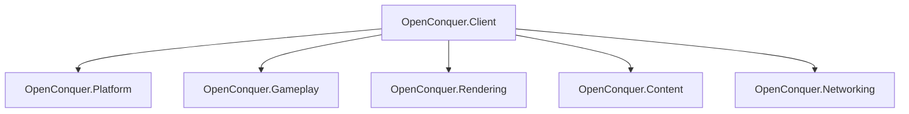
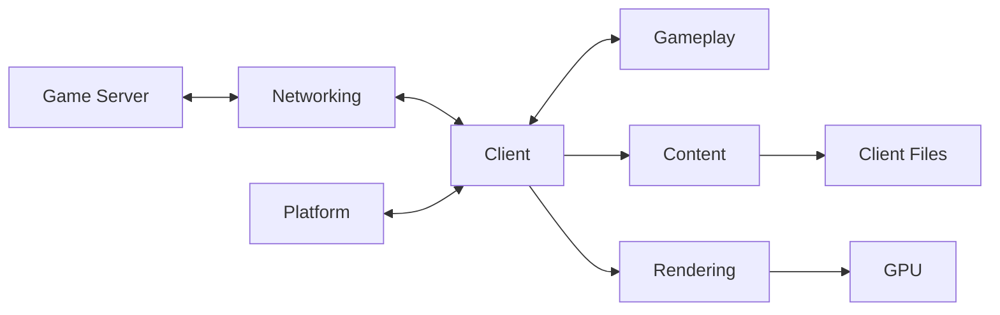
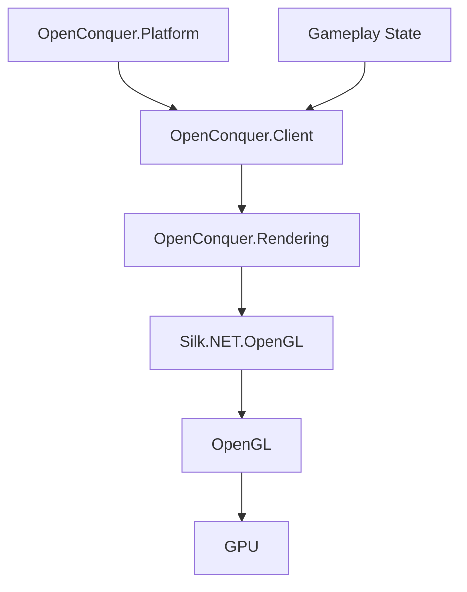

# Client Architecture

This document describes the high-level architecture of OpenConquer Client for contributors and
developers interested in the project.

It is intentionally focused on subsystem boundaries, dependencies, ownership, and lifetime.
Compatibility-specific native graphics requirements are documented separately.

## Projects



`OpenConquer.Client` is the composition root. Subsystem projects remain independent unless a real
ownership or behavioral requirement justifies a dependency between them.

In particular, `OpenConquer.Platform` and `OpenConquer.Rendering` are sibling subsystems and do not
reference one another.

## Responsibilities

| Project                  | Owns                                                                                                                                |
| ------------------------ | ----------------------------------------------------------------------------------------------------------------------------------- |
| `OpenConquer.Client`     | process entry point, startup-option validation, subsystem composition, application lifetime, and shutdown coordination              |
| `OpenConquer.Platform`   | desktop windowing, native graphics-context lifetime, physical framebuffer state, native buffer swapping, and future desktop input   |
| `OpenConquer.Gameplay`   | game state, entities, movement, combat, interactions, and gameplay rules                                                            |
| `OpenConquer.Rendering`  | OpenGL integration, logical rendering, logical-to-host framebuffer composition, cameras, shaders, GPU resources, and render targets |
| `OpenConquer.Content`    | client-root filesystem semantics, legacy configuration and formats, decoding, loading, and content lookup                           |
| `OpenConquer.Networking` | connections, transport, encryption, packet framing, protocol encoding, and decoding                                                 |

Platform-specific window and context types remain inside `OpenConquer.Platform`. Rendering owns
graphics behavior and GPU resources without depending on the windowing subsystem.

## Runtime Flow

The runtime flow is directional, with `OpenConquer.Client` coordinating independent subsystems.



The application begins and ends in `OpenConquer.Client`. Platform provides the desktop runtime,
Content provides access to legacy client data, Networking communicates with the server, Gameplay
owns simulation state, and Rendering consumes the state required to produce a frame.

## Startup and Content Boundary

Startup configuration belongs to the executable composition boundary rather than to Content,
Platform, or Rendering.

`ClientStartupOptions` interprets the currently supported process arguments before the application
is created.

The supported startup form is:

```text
OpenConquer.Client [--content-root <path>]
```

With no explicit content root, startup uses `AppContext.BaseDirectory`, making content discovery
deterministic relative to the executable rather than dependent on the process working directory.

An explicit `--content-root` may be absolute or relative. Relative overrides are resolved against
the process working directory at startup and normalized to an absolute path.

Malformed startup input is rejected before application construction. Unknown arguments, duplicate
content-root declarations, and missing content-root values are not silently ignored.

The resulting content-root path is passed into `ClientApplication`. The application then constructs
`ClientContentRoot`; Content does not depend on or receive the executable's complete startup-options
object.

```text
process arguments
        │
        ▼
ClientStartupOptions
        │
        │ absolute ContentRootPath
        ▼
ClientApplication
        │
        ▼
ClientContentRoot
        │
        ▼
legacy client files
```

`ClientContentRoot` establishes the legacy client filesystem boundary.

It:

- requires an existing root directory
- accepts legacy `/` and `\` separators
- resolves path segments case-insensitively to preserve Windows-era client lookup semantics on
  case-sensitive filesystems
- rejects rooted content paths
- rejects `.` and `..` traversal segments
- rejects ambiguous case-insensitive matches instead of selecting one nondeterministically
- distinguishes optional lookup from required-file lookup

Filesystem enumeration and I/O failures are not converted into false "not found" results. Unexpected
filesystem failures remain visible to the caller.

The first production consumer of this boundary is the retail screen-mode configuration.

At startup, `GameSetupConfiguration` resolves:

```text
ini/GameSetup.Ini
```

and reads:

```ini
[ScreenModeRecord]
ScreenMode=<value>
```

Legacy section and key matching are case-insensitive. The file is read using Latin-1-compatible text
decoding appropriate for the legacy client data.

The verified retail screen-mode mapping is:

| ScreenMode | Logical resolution |
| ---------: | -----------------: |
|          0 |            800×600 |
|          1 |            800×600 |
|          2 |           1024×768 |
|          3 |           1024×768 |

Missing configuration, a missing screen-mode value, or a value outside the verified range fails
startup explicitly rather than inventing unsupported fallback behavior.

The Content project interprets the legacy configuration. It does not construct Rendering types.
`ClientApplication` bridges the resulting dimensions into `LogicalRenderSize`, preserving the
dependency boundary between Content and Rendering.

## Platform Boundary

`OpenConquer.Platform` owns behavior whose semantics come from the desktop environment:

- native window creation and destruction
- OpenGL context creation and lifetime
- physical framebuffer dimensions
- native host-buffer swapping
- focus and window state
- desktop input when introduced

Silk.NET windowing and input types must not leak into Gameplay, Rendering, Content, or Networking.

`OpenConquer.Client` depends on Platform as a consumer and composition root rather than implementing
platform behavior itself.

Framebuffer dimensions are represented by `PixelSize`. Zero-sized dimensions are valid because a
desktop framebuffer may temporarily have no drawable area while minimized. Negative dimensions are
rejected at the type boundary.

## Rendering Boundary



Platform owns the native window and OpenGL context. Rendering owns the OpenGL API binding and GPU
resources. Client composes those lifetimes without creating a direct dependency between Platform and
Rendering.

Rendering also owns the logical-to-host framebuffer composition step. Platform owns the subsequent
native buffer swap.

### OpenGL Bootstrap

The native OpenGL context is owned by `OpenConquer.Platform`.

Once the desktop window has initialized its graphics context, Platform exposes a narrow borrowed
`IOpenGlContext` capability to `OpenConquer.Client`. Silk.NET window and context types remain
internal to Platform.

Client bridges the Platform-owned context into Rendering through an OpenGL procedure-address
resolver:

```text
OpenConquer.Platform
        │
        │ IOpenGlContext.GetProcAddress
        ▼
OpenConquer.Client
        │
        │ OpenGlProcAddressResolver
        ▼
OpenConquer.Rendering
        │
        │ GL.GetApi(...)
        ▼
Silk.NET.OpenGL
```

`OpenConquer.Rendering` therefore does not depend on `OpenConquer.Platform`, `Silk.NET.Windowing`,
or Silk.NET context types.

`OpenGlGraphicsDevice` owns the Silk.NET OpenGL API binding but does not own the native OpenGL
context.

Graphics-device initialization verifies that the active context satisfies the renderer's OpenGL 3.3
Core requirement. The device also captures the runtime OpenGL, GLSL, vendor, and renderer identity
for diagnostics and compatibility reporting.

Platform guarantees that the OpenGL context exists and is current when graphics initialization,
frame rendering, and graphics shutdown callbacks execute.

## Logical Rendering and Host Composition

The logical game surface is independent of the physical desktop framebuffer.

`OpenConquer.Rendering` receives an explicit `LogicalRenderSize` selected by the application.
Logical dimensions must be positive.

The application obtains the logical size from the verified retail `ScreenMode` value in
`ini/GameSetup.Ini`. Modes 0 and 1 select 800×600; modes 2 and 3 select 1024×768.

Rendering does not read legacy configuration and does not derive the logical size from the desktop
window.

`OpenConquer.Platform` separately reports the physical framebuffer through `PixelSize`. Its
dimensions change as the resizable host window changes.

```text
GameSetup.Ini
        │
        │ ScreenMode
        ▼
GameSetupConfiguration
        │
        │ 800×600 or 1024×768
        ▼
LogicalRenderSize
        │
        ▼
OpenGlRenderTarget
        │
        │ render logical frame
        ▼
fixed logical framebuffer
        │
        │ OpenGlRenderer linear color blit
        ▼
physical host framebuffer
        │
        │ Platform native buffer swap
        ▼
desktop window
```

The distinction is intentional:

- logical dimensions define the game rendering coordinate space
- physical framebuffer dimensions define only the host composition destination
- resizing the desktop window does not change the logical game resolution
- minimizing the host may temporarily produce a zero-sized physical framebuffer without changing the
  logical render target

The original 5517 client supports four screen modes spanning 800×600 and 1024×768 logical
resolutions. The modern client now preserves the verified logical-resolution selection while
intentionally retaining its resizable desktop-host policy.

The shell behavior associated with retail modes 1 and 3 is not inferred by Rendering from the mode
integer. Desktop-window behavior remains a Platform/application policy separate from logical
rendering resolution.

The desktop host is intentionally resizable. This is a modernization over the original fixed-window
behavior while preserving the game's fixed logical rendering coordinate system.

`OpenGlRenderer` blits the logical color buffer across the complete physical host framebuffer using
linear filtering.

## Logical Render Target

`OpenGlRenderTarget` owns the logical framebuffer and its GPU attachments:

```text
logical framebuffer
├── RGB565 preferred / RGB5 fallback color texture
└── 16-bit depth renderbuffer
```

The logical target intentionally has no stencil attachment.

The render target preserves the verified retail 5517 16-bit color and depth contracts. Rendering
prefers an actual 5/6/5/0 color allocation and falls back to an actual 5/5/5/0 allocation. Requested
color formats are accepted only after OpenGL reports the expected component sizes, and the depth
renderbuffer is accepted only when OpenGL reports exactly 16 depth bits.

Frame initialization establishes deterministic full-target clear state. Scissoring is disabled,
color and depth writes are enabled, the color buffer is cleared to opaque black, and the depth
buffer is cleared to `1.0`.

OpenGL dithering is explicitly disabled for logical framebuffer rendering to preserve the verified
retail 16-bit rendering behavior rather than inheriting OpenGL's default dithering state.

The native evidence and compatibility requirements are documented in
[`docs/compatibility/native-graphics.md`](../compatibility/native-graphics.md).

The desktop/default framebuffer is host-composition-only. Rendering blits only color into it, so
Platform does not request depth or stencil storage for the host framebuffer.

## Graphics Ownership and Lifetime

Graphics resources follow strict deterministic ownership.

```text
Create:

window / OpenGL context
        ↓
OpenGL API binding
        ↓
renderer / render target


Destroy:

renderer / render target
        ↓
OpenGL API binding
        ↓
OpenGL context
        ↓
window
```

GPU resources must be destroyed while the OpenGL context required to destroy them is still valid and
current.

`OpenGlRenderTarget` owns its framebuffer, color texture, and depth renderbuffer. `OpenGlRenderer`
owns the render target. `OpenGlGraphicsDevice` owns the Silk.NET OpenGL API binding. `DesktopWindow`
owns the native window and native OpenGL context.

`OpenConquer.Client` coordinates the ordering between Rendering and the Platform-owned context
without taking ownership of either subsystem's native resources.

The desktop runtime deliberately owns the lower-level Silk.NET view lifecycle instead of using the
convenience window loop that resets the view before returning. This keeps the native OpenGL context
alive until `OpenConquer.Client` has released the renderer and OpenGL API binding.

Normal graphics shutdown therefore follows:

```text
desktop loop exits
        ↓
Platform requests graphics release
        ↓
Client disposes OpenGlRenderer
        ↓
OpenGlRenderer disposes OpenGlRenderTarget
        ↓
Client disposes OpenGlGraphicsDevice
        ↓
Platform disposes OpenGL context and window
```

Exceptional loop termination follows the same ownership rule: graphics teardown is attempted while
the native context still exists, and the original loop failure remains the primary exception.

Graphics initialization and shutdown paths are exception-safe. Managed input validation occurs
before native resource acquisition, partially initialized GPU resources are released
deterministically, and graphics teardown is attempted before Platform destroys the context.

Platform and Client transition to their terminal disposed state even if underlying native disposal
throws.

## Frame Lifecycle

The current graphics frame flows through the client as follows:

```text
Platform render callback
        ↓
OpenConquer.Client
        ↓
OpenGlRenderer.RenderFrame
        ↓
OpenGlRenderTarget.BeginFrame
        ↓
bind fixed logical framebuffer
        ↓
establish deterministic frame state
        ↓
clear logical color + depth
        ↓
OpenGlRenderer blits logical color
        ↓
default host framebuffer
        ↓
Platform swaps host buffers
```

Higher-level scene submission has not yet been implemented. The current renderer establishes and
validates the logical render-target and host-composition lifecycle only.

Before the host blit, Rendering disables state that could unintentionally affect the composition
operation, including scissor testing and framebuffer sRGB conversion.

The renderer restores the default framebuffer after host composition, including when composition is
skipped because the host framebuffer has zero area while minimized.

Host framebuffer resizing changes only the destination dimensions. It does not recreate or resize
the logical render target.

## Host Presentation Policy

Desktop-host behavior is explicit rather than inherited accidentally from backend defaults.

The desktop window currently uses:

- automatic native buffer swapping
- VSync disabled
- a resizable 1280×720 initial host window
- an OpenGL 3.3 Core forward-compatible context
- no host framebuffer multisampling
- no requested depth buffer on the host framebuffer
- no requested stencil buffer on the host framebuffer

The host framebuffer is explicitly single-sampled. Native multisampling behavior, when implemented,
belongs to the logical rendering path rather than being inherited from a window-system default.

The disabled-VSync policy preserves the verified retail 5517 presentation contract. Detailed native
evidence and compatibility requirements are documented in
[`docs/compatibility/native-graphics.md`](../compatibility/native-graphics.md).

Presentation cadence does not define gameplay simulation timing. Display presentation and game
simulation remain separate concerns.

Rendering produces the completed host framebuffer. Platform owns the native operation that makes
that framebuffer visible by swapping the host buffers.

## Dependency Rules

Dependencies are introduced only when a subsystem genuinely requires another subsystem's behavior or
ownership.

The current architecture follows these rules:

- `OpenConquer.Client` is the sole composition root.
- `OpenConquer.Platform` does not reference `OpenConquer.Rendering`.
- `OpenConquer.Rendering` does not reference `OpenConquer.Platform`.
- `OpenConquer.Rendering` does not depend on Silk.NET Windowing, Maths, or Input.
- `OpenConquer.Client` does not directly depend on Silk.NET.
- `OpenConquer.Platform` directly declares the Silk.NET packages whose APIs it consumes.
- `OpenConquer.Gameplay` remains independent of platform, graphics, and transport infrastructure.
- `OpenConquer.Content` remains independent of graphics and gameplay behavior.
- `OpenConquer.Networking` remains independent of platform and rendering concerns.

A project is an ownership and dependency boundary, not a replacement for a folder.
