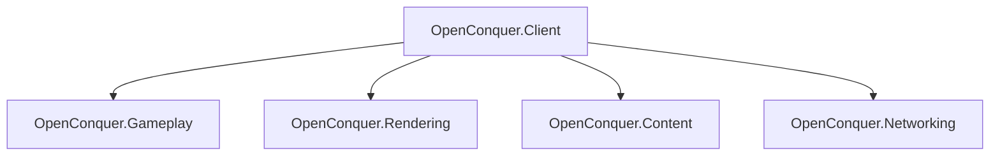
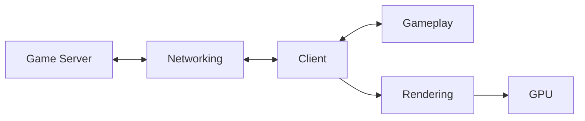
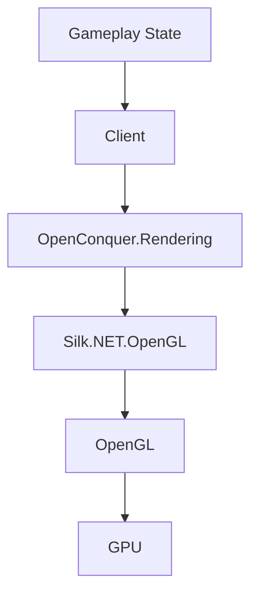

# Client Architecture

This document serves to describes the high level architecture of OpenConquer Client, for those
looking to contribute/join the effort or use the project for their own learning.

It is intentionally focused on subsystem boundaries and ownership. More detailed designs should live
beside the subsystem they describe.

## Projects

## Responsibilities

| Project                  | Owns                                                                                   |
| ------------------------ | -------------------------------------------------------------------------------------- |
| `OpenConquer.Client`     | application lifetime, windowing, input, main loop orchestration, subsystem composition |
| `OpenConquer.Gameplay`   | game state, entities, movement, combat, interactions, gameplay rules                   |
| `OpenConquer.Rendering`  | rendering, cameras, shaders, GPU resources, render targets, visual effects             |
| `OpenConquer.Content`    | client filesystem behavior, legacy formats, decoding, loading, content lookup          |
| `OpenConquer.Networking` | connections, transport, encryption, packet framing, protocol encoding and decoding     |

## Runtime Flow

The intended flow through the client is directional.

## Rendering Boundary

